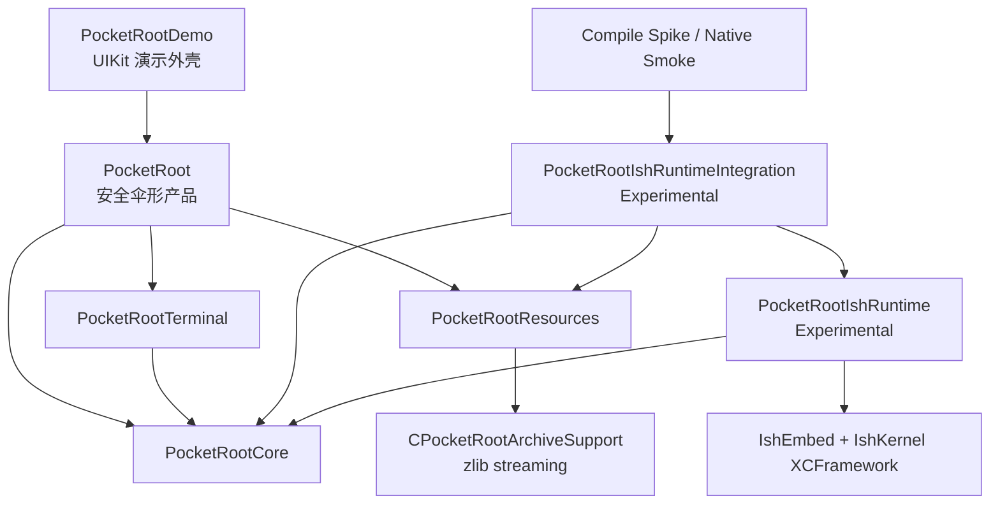
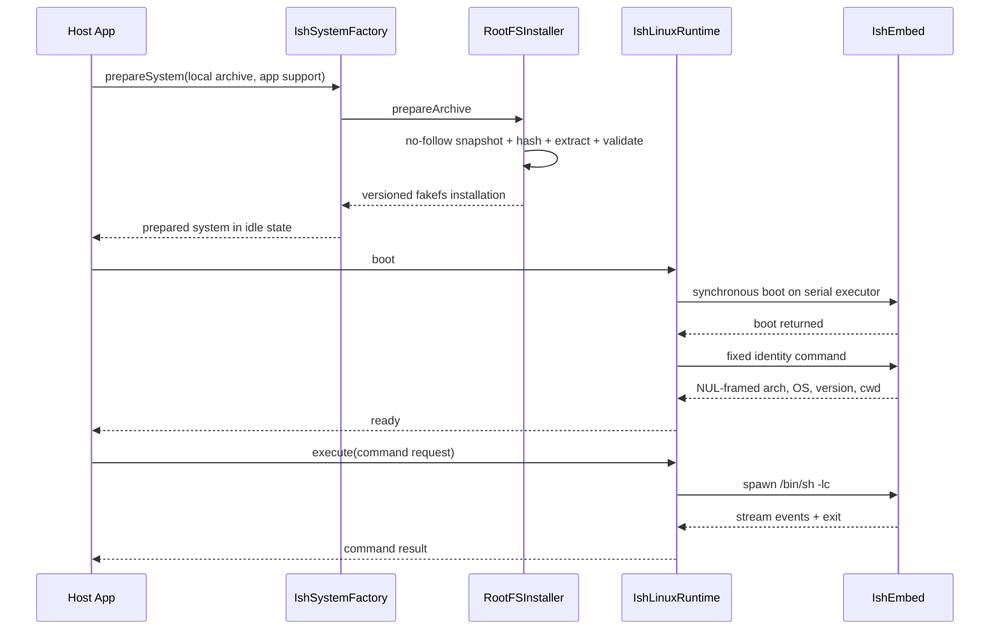
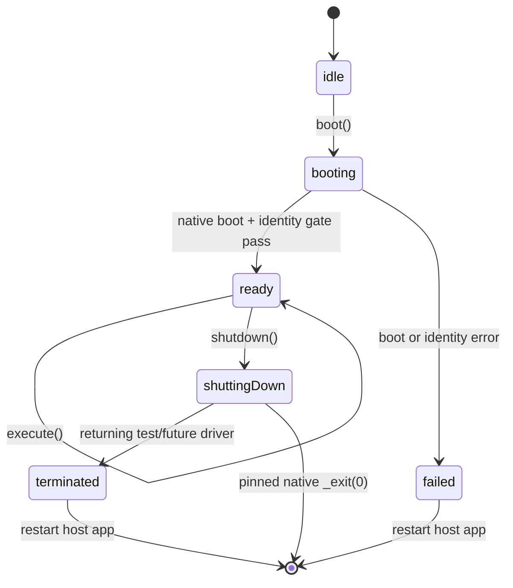

# PocketRoot 架构说明

[简体中文](Architecture.md) | [English](en/Architecture.md) | [文档中心](README.md)

## 1. 架构目标

PocketRoot 把可复用 Linux 能力与 UIKit Demo 分离，并把高风险的原生 iSH 依赖放在显式启用的实验产品后面。

核心目标：

- 默认依赖安全，不因为导入伞形产品就链接 IshEmbed。
- Core 不依赖 UIKit 或具体 Linux runtime。
- RootFS 输入、安装和恢复独立于 runtime 生命周期。
- 原生同步调用不阻塞主线程或 Swift cooperative executor。
- iSH 的进程级单例约束在 Swift 层可见且可测试。
- 终端 UI 在 PTY 生命周期证明安全后再接入。
- 外部源码和制品均可追溯到不可变输入。

## 2. 支持基线

| 项目 | 基线 |
| --- | --- |
| App deployment target | iOS 18.0 |
| 开发环境 | Xcode 16.0+ 与 iOS 18 SDK |
| Swift Package manifest | Swift 5.10+ |
| Xcode language mode | Swift 5，targeted strict concurrency |
| 原生平台 | arm64 iOS device 与 arm64 iOS Simulator |
| 宿主测试声明 | macOS 13，仅用于 package tests |

IshEmbed XCFramework 没有 macOS 或 x86_64 Simulator 切片。macOS fallback 只用于测试 adapter seam。原生路径已在较新 Xcode 上验证；最低 Xcode 16 行为仍以[路线图](Roadmap.md)为准。

## 3. 模块依赖



依赖方向文字说明：

- `PocketRootCore` 位于底层，不依赖 UIKit、Resources 或 IshEmbed。
- `PocketRootTerminal` 只依赖 Core。
- `PocketRootResources` 通过私有 C target 使用 zlib，不依赖 runtime。
- `PocketRootIshRuntime` 依赖 Core 和仅 iOS 条件下的 IshEmbed。
- `PocketRootIshRuntimeIntegration` 是 Resources 与 runtime 的唯一公共组合入口。
- `PocketRoot` 只导出 Core、Terminal、Resources。
- 默认 Demo 只依赖 `PocketRoot`；compile spike 和 smoke 才依赖实验组合。

## 4. 模块职责

### PocketRootCore

源码：`Sources/PocketRootCore/`

负责：

- `PocketRootSystem` actor；
- runtime 状态和生命周期协调；
- 一次性命令请求与结果；
- typed errors；
- RootFS provider 与 session 抽象；
- 默认 `PlaceholderLinuxRuntime`。

约束：

- 只使用 Foundation 与 Swift Concurrency。
- 不导入 UIKit。
- 不知道 fakefs 的解包细节。
- 不直接持有 IshEmbed 类型。

默认公开初始化器和 `PocketRootSystem.shared` 都使用 placeholder。真实系统只能由 package 内 runtime factory 组合。

### PocketRootResources

源码：`Sources/PocketRootResources/` 与 `Sources/CPocketRootArchiveSupport/`

负责：

- 不可变 RootFS artifact manifest；
- 本地普通文件校验；
- 流式 SHA-256；
- zlib gzip 解压；
- 受限 POSIX ustar 解包；
- fakefs 布局校验；
- 版本化安装、复用、损坏替换；
- 文件型 promotion transaction、rollback 和中断恢复。

该模块不下载 RootFS。`downloadURL` 是供应链元数据。详细不变量见 [RootFS 安全方案](RootFS.md)。

### CPocketRootArchiveSupport

这是不暴露给客户端的窄 C target，只提供 zlib gzip streaming primitive：

- 只创建输出文件；
- 强制展开字节上限；
- 失败时移除部分输出；
- 链接系统 `libz`。

tar 解析、路径策略和 fakefs 校验仍由 Swift 层负责。

### PocketRootIshRuntime（Experimental）

源码：`Sources/PocketRootIshRuntime/`

负责：

- 将 Core 的 package-scoped `LinuxRuntime` 映射到固定 IshEmbed；
- fakefs 启动前检查；
- 进程级 ownership gate；
- 阻塞原生调用串行执行；
- boot、一次性命令和进程终止式 shutdown；
- shell、环境、cwd、timeout、stream、exit 和 signal 映射；
- stdout/stderr 独立上限。

它不在伞形产品中。unsupported host 使用非原生 driver，使宿主测试不必链接 iOS XCFramework。

### PocketRootIshRuntimeIntegration（Experimental）

源码：`Sources/PocketRootIshRuntimeIntegration/`

`PocketRootIshSystemFactory.prepareSystem`：

1. 接收调用方本地 archive；
2. 使用 Resources 验证并物化；
3. 把 `PocketRootConfiguration.rootFSVersion` 对齐到 manifest；
4. 创建绑定该 fakefs 的原生 runtime；
5. 返回 installation 与尚未 boot 的 `PocketRootSystem`。

该入口不下载、不自动 boot，也不替换 `PocketRootSystem.shared`。

### PocketRootTerminal

源码：`Sources/PocketRootTerminal/`

提供 terminal configuration、theme 和 UIKit view controller。当前实现是占位 UI：

- 可追加/清空 transcript；
- 建立 UIKit 嵌入契约；
- 没有 SwiftTerm 依赖；
- 没有 PTY、实时输入、resize 或 signal。

所有 UIKit 类型和 UI mutation 都隔离到 `MainActor`。

### PocketRoot

源码：`Sources/PocketRoot/`

安全伞形 import，重新导出 Core、Terminal、Resources。它故意不导出两个 Experimental runtime 产品。

### PocketRootDemo

源码：`Demo/PocketRootDemo/`

使用 AppDelegate、SceneDelegate、UIWindow、UIKit 和 Auto Layout，包含 System、Terminal、Commands、Diagnostics 四个 navigation stack。Demo 只演示公共 API 和页面边界，不含 runtime 实现或 RootFS 资产。

## 5. 端到端数据流



图中的关键边界：

- App 在调用 factory 之前已经拥有本地 archive。
- 安装和 boot 是两个独立动作。
- 安装完成不代表 native runtime 已启动。
- native boot 返回也不单独代表 ready；内置 identity gate 必须匹配配置。
- 一次性命令收集有界输出；不是交互 session。
- shutdown 未画入正常返回流程，因为固定上游会结束宿主进程。

## 6. 并发模型

### PocketRootSystem

`PocketRootSystem` 是 actor，序列化公共 lifecycle 与命令调用。底层 `IshLinuxRuntime`
会在第一次 suspension 前更新自己的内部过渡状态，以关闭 boot/shutdown 的 actor
重入窗口；公开的 `PocketRootSystem.state` 则只在 `boot()` / `shutdown()` 返回或抛错后
从 `RuntimeCoordinator` 刷新。因此内部 `.booting` / `.shuttingDown` 不能被当作公开、
实时的进度通知。

### RootFS 安装

`PocketRootRootFSInstaller` 是 actor，但实际阻塞文件工作进入进程级串行 installation executor。并发准备同一版本不会同时 promotion。

### 原生 runtime

IshEmbed 暴露同步、进程级 API。adapter 使用：

- `IshProcessGate`：一个 App 进程只有一个 owner；
- `BlockingIshExecutor`：所有 native call 在共享 serial DispatchQueue 上执行；
- actor 状态：在第一次 suspension 前关闭 boot/shutdown reentrancy window；
- `commandInFlight`：同一 runtime 只允许一个 one-shot；
- bounded poll：native read 最长约 250 ms 后回到 deadline 检查；
- stdout/stderr limits：超限终止 session。
- 退出确认：session 建立后的 stdin/read/timeout/超限错误先终止并确认可信 `EXITED`；无法确认时失败关闭整个进程 gate。固定 supervisor 在创建 guest 前拒绝命令时返回的负数合成 exit 作为保留来源的可恢复错误处理。

这些机制避免并发 boot、命令越过 shutdown，并限制 session 建立后 event-read loop 的等待和 Swift 已收集结果的大小。deadline 在同步 `spawn` 与 `closeStdin` 返回后才创建；当前固定 v0.3.3 native transport 的 control write、terminate、close 仍可能阻塞，未读 session inbox 也没有独立容量上限。因此当前不能宣称 `execute()` 具有端到端硬时间界限或整个宿主进程具备完整内存背压。Swift Task cancellation 也尚未成为完整 native kill 契约。

## 7. 生命周期

下图描述底层 runtime 的内部生命周期，而不是 `PocketRootSystem.state` 的实时可观察轨迹：



文字约束：

- `execute` 只在 `ready` 接受。
- boot 失败但已经占用全局进程时，通常必须重启宿主 App。
- active command 存在时拒绝 shutdown。
- 固定 native shutdown 结束整个进程；Swift 通常看不到 `terminated`。
- “shutdown 后 boot” 不是当前能力。
- 默认 placeholder 的 shutdown 只保持 idle，不代表 native shutdown 语义。

## 8. RootFS 存储模型

```text
applicationSupportURL/
└── rootfs/
    ├── current.json
    ├── .installing-<uuid>/              # 临时、私有、同卷
    ├── .replacement-transaction/        # 替换中断时的文件型恢复区
    └── <manifest-version>/
        ├── .pocketroot-rootfs.json
        ├── meta.db
        └── data/
```

归档内的 fakefs 位于顶层 `fs/`，但 installer 提升的是 `fs/` 目录本身，所以最终
`rootfs/<version>` 下直接是 `meta.db`、`data/` 和 `.pocketroot-rootfs.json`，没有额外
`fs/` 层。

候选验证后，installer 通过 journal 保护的多步同卷 rename 进行 promotion。每次 rename
和 JSON 记录写入各自具有原子性，但整个替换不是一次整体原子操作；失败时会回滚，
进程中断后可恢复。journal 不记录 phase，而是保存预期安装记录、是否曾有旧版本以及旧
`current.json` 数据；恢复时根据 final 是否匹配预期记录、backup 是否存在以及旧安装事实推断应完成提交还是回滚。

复用只要求版本目录布局有效且版本内安装记录匹配 manifest。`current.json` 缺失或不匹配
不会阻止复用；installer 会在返回前将其重写为一致记录。

## 9. 工程生成与验证边界

- `Package.swift`：Swift Package 产品、依赖和 test target 事实源。
- `Package.resolved`：当前精确 dependency resolution。
- `project.yml`：Demo、compile spike、smoke target 和 scheme 事实源。
- `PocketRootDemo.xcodeproj`：生成物，不提交。
- `.github/workflows/ci.yml`：host tests、真实 RootFS test、Demo build 与 arm64 final-link。
- `Scripts/run-runtime-smoke.sh`：本地 iOS 18 Simulator 原生行为门禁。

CI 与测试职责见[测试与验证](Testing.md)。动态完成状态见[路线图](Roadmap.md)。

## 10. 未来集成缝隙

- `PocketRootSession`：长运行进程 I/O 抽象。
- live session registry：native 指针所有权与 close 顺序。
- bounded PTY reads：让取消和 shutdown 可观察。
- `TerminalBridge`：在 PTY 契约稳定后连接固定 SwiftTerm。
- 应用专属 post-boot health：在基础 identity gate 之后验证业务工具、网络和数据。
- soft-shutdown IshEmbed build：关闭 kernel thread 而不是宿主进程。

完整源码调用链见[实现原理](Implementation.md)。
