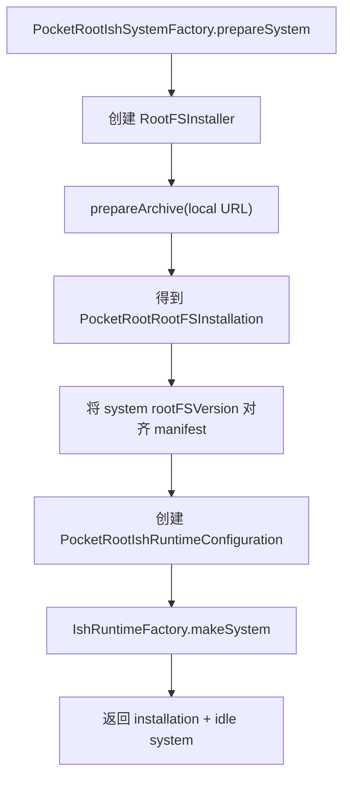

# PocketRoot 实现原理

[简体中文](Implementation.md) | [English](en/Implementation.md) | [文档中心](README.md)

本文把公开 API 映射到实际源码和端到端执行流程，说明“调用一个方法后，工程内部究竟发生什么”。架构边界见[架构说明](Architecture.md)，对外接入契约见[应用接入指南](IntegrationGuide.md)。

## 1. 源码地图

| 能力 | 入口 | 主要实现 |
| --- | --- | --- |
| 公共系统 | `PocketRootSystem` | `Sources/PocketRootCore/Public/PocketRootSystem.swift` |
| 生命周期协调 | `RuntimeCoordinator` | `Sources/PocketRootCore/Runtime/RuntimeCoordinator.swift` |
| 默认占位 runtime | `PlaceholderLinuxRuntime` | `Sources/PocketRootCore/Runtime/PlaceholderLinuxRuntime.swift` |
| 轻量 agent loop | `PocketRootAgentRunner` | `Sources/PocketRootAgent/` |
| RootFS 清单 | `PocketRootRootFSArtifactManifest` | `Sources/PocketRootResources/RootFSArtifactManifest.swift` |
| Archive 校验 | `PocketRootRootFSValidator` | `Sources/PocketRootResources/RootFSValidator.swift` |
| gzip/ustar 解包 | `PocketRootGzipTarExtractor` | `Sources/PocketRootResources/RootFSGzipTarExtractor.swift` |
| zlib primitive | C API | `Sources/CPocketRootArchiveSupport/` |
| RootFS 安装 | `PocketRootRootFSInstaller` | `Sources/PocketRootResources/RootFSInstaller.swift` |
| 原生 runtime factory | `PocketRootIshRuntimeFactory` | `Sources/PocketRootIshRuntime/Public/` |
| RootFS/runtime 组合 | `PocketRootIshSystemFactory` | `Sources/PocketRootIshRuntimeIntegration/` |
| iSH adapter | `IshLinuxRuntime` | `Sources/PocketRootIshRuntime/Runtime/` |
| 原生 driver | `IshEmbedDriver` | `Sources/PocketRootIshRuntime/Native/` |
| 原生串行执行 | `BlockingIshExecutor` | `Sources/PocketRootIshRuntime/Concurrency/` |
| 进程所有权 | `IshProcessGate` | `Sources/PocketRootIshRuntime/Concurrency/` |
| Terminal UI | `PocketRootTerminalViewController` | `Sources/PocketRootTerminal/` |
| Demo | UIKit controllers | `Demo/PocketRootDemo/` |
| 最终链接验证 | compile spike | `Spikes/PocketRootIshRuntimeCompileSpike/` |
| 原生行为验证 | smoke App | `Spikes/PocketRootIshRuntimeSmoke/` |

## 2. 默认系统为什么不能启动 Linux

`PocketRootSystem()` 和 `PocketRootSystem.shared` 构造时注入 `PlaceholderLinuxRuntime`：

```text
PocketRootSystem.shared
  └── RuntimeCoordinator
      └── PlaceholderLinuxRuntime
```

结果：

- `boot()` 抛出 `unsupportedOperation`；
- `execute()` 抛出 `runtimeNotBooted`；
- `shutdown()` 保持 idle；
- 导入默认 `PocketRoot` 不会链接 IshEmbed。

这是安全默认行为，不是临时绕过。真实系统必须通过实验性 factory 创建：

```text
PocketRootIshSystemFactory.prepareSystem(...)
  └── PocketRootIshRuntimeFactory.makeSystem(...)
      └── PocketRootSystem(package runtime: IshLinuxRuntime)
```

factory 返回的新对象不会替换 `PocketRootSystem.shared`。业务代码必须保存并注入这个实例。

## 3. `prepareSystem` 调用链



参数映射：

- `archiveURL` → installer 的本地输入。
- `applicationSupportURL` → RootFS 安装根。
- `manifest` → 版本、架构、格式、大小、展开上限、SHA-256。
- `workDirectory` → iSH boot options 的 guest workdir，默认 `/`。
- `supervisorGuestPath` → 可选 guest supervisor；进入原生 boot 前拒绝 NUL，避免 C 字符串静默截断。
- `kernelLogFileDescriptor` → iSH kernel log FD，默认 `-1`。
- stdout/stderr limits → 每个 native session 的最大累计输出。
- `healthCheck` → `boot()` 返回前必须匹配的 guest 架构、OS ID、可选版本和最多 60 秒的检查超时；内置 v0.3.3 RootFS 清单默认要求 `aarch64`、`alpine`、`3.19.1`。

`systemConfiguration` 中的 rootFSVersion 会被 manifest version 替换，避免系统配置与实际安装漂移；default working directory 与 command timeout 被保留。但当前每个 `PocketRootCommandRequest` 仍使用自己的值。

## 4. RootFS 安装算法

### 4.1 串行与恢复优先

`PocketRootRootFSInstaller` 是 actor，阻塞文件操作进入共享 `RootFSInstallationExecutor`。每次准备先：

1. 验证 base URL 是调用方已创建的本地真实目录；installer 不递归创建未知祖先；
2. 规范化 manifest version，拒绝不安全目录名；
3. 创建真实、非符号链接的 `rootfs/` 目录；
4. 检查文件型 replacement journal；
5. 完成或回滚上一次中断的 rename；
6. 清理确认不再需要的 stale staging。

`rootfs/` 通过原子 `mkdir` 创建；`EEXIST` 只表示需要重新验证现有路径，
不能跳过真实目录与符号链接检查。共享 executor 只保证进程内串行，
多个进程同时操作同一个 base directory 不属于支持范围。

恢复发生在新安装之前，避免旧事务和新候选交叉。

### 4.2 容量预检与私有 archive snapshot

只有目标版本不能安全复用时，installer 才按 manifest 与实际 extractor 上限计算新增空间：
压缩 snapshot 加上两份展开上限和 16 MiB；自定义 extractor 更宽时采用较大值。两份展开
空间分别用于 gzip 临时 tar 和 tar 尚未删除时写出的 payload。它读取目标卷
important-usage 容量；不足时在创建 staging 前返回包含 required 与 available byte count
的 typed 错误。

调用方路径可能在异步安装过程中被替换，因此 installer 不直接在原路径验证后再解包：

1. 以 `O_NOFOLLOW` 打开源文件；
2. 用 `fstat` 确认它是普通文件；
3. 在同卷创建私有 `.installing-<uuid>`；
4. 以 exclusive create 和仅用户权限创建 snapshot；
5. 边复制边检查取消和压缩字节上限；
6. 只对 snapshot 做大小与 SHA-256 验证；
7. 解包后再次验证同一 snapshot。

这样源路径随后被替换也不会改变已经锁定的实际输入。

仅测试可见的写入故障点可在 snapshot、gzip 输出、tar payload、安装记录、promotion
journal 和 current record 注入 ENOSPC。gzip 故障发生在 C/zlib 已接受指定数量输出之后，
以验证部分 tar 会删除；其余故障复用生产 cleanup/rollback 路径，不改变公开 API。

进入 promotion 前，候选普通文件以 `F_FULLFSYNC`（不支持时回退 `fsync`）持久化，目录
从叶到根同步。journal 和 current record 使用同目录私有临时文件，完整写入和同步后原子
rename，再同步父目录。每个跨目录 rename 后同步源、目标父目录；rollback/recovery 的
rename、记录恢复和 transaction 删除采用相同规则。仅测试可见的七个同步屏障覆盖候选树、
journal 文件/目录、两个 promotion rename 和 current 文件/目录。候选条目缺少 owner
read/search 权限时，installer 只在私有 staging 中临时添加所需权限，通过已打开 descriptor
恢复原 mode 后再同步，最终权限不变。删除失败 staging 或旧 backup 前，只对即将删除的
目录树临时添加 owner traversal/write 权限，不跟随 link。

### 4.3 gzip 与 tar

gzip：

- 使用 `CPocketRootArchiveSupport` 的 zlib streaming；
- 不启动宿主 `gzip` 或 `tar` 进程；
- 强制 expanded byte ceiling；
- 解压失败删除部分输出。

tar：

- 解析 POSIX ustar header；
- 验证 header checksum；
- 只接受 UTF-8 相对路径；
- 拒绝绝对路径、`.`、`..` 和路径逃逸；
- 把条目隐式创建的每一级父目录也登记为 archive target，拒绝后续映射到同一路径或同一文件系统目标的重复文件和目录；
- 接受普通文件、目录和被忽略内容的 PAX 扩展记录；
- 拒绝 symlink、hardlink、设备节点和其他特殊类型；
- 默认最多 100,000 条目；
- 同时限制 entry payload 总量。

### 4.4 fakefs 布局

归档必须包含顶层 `fs/`。物化结果必须满足：

- `fs/` 是真实目录；
- `fs/meta.db` 是真实普通文件；
- `fs/data/` 是真实目录；
- 三者都不是符号链接。

安装时不对 `meta.db` 每次执行 SQLite `integrity_check`。完整内容可信度来自固定 archive SHA-256；布局检查负责阻止错误形态进入 runtime。

校验通过后，`extracted/fs` 目录本身成为 promotion 候选。它被 rename 到
`rootfs/<version>`，所以最终目录直接包含 `meta.db`、`data/` 和
`.pocketroot-rootfs.json`，不会形成 `rootfs/<version>/fs/...`。

### 4.5 安装记录与可恢复 promotion

候选目录写入 `.pocketroot-rootfs.json`，记录 manifest 关键字段。`rootfs/current.json` 指向当前版本。

promotion 的实际顺序是：

1. 创建 `.replacement-transaction/`；
2. 原子写入 journal，记录目标版本、预期安装记录、是否已有旧安装和旧 `current.json` 数据；
3. 若已有同版本，把旧 final 通过同卷 rename 移到 transaction 的 `previous/`；
4. 把候选通过同卷 rename 提升到 `rootfs/<version>`；
5. 原子写入 current record；
6. 删除 transaction（包括 previous 和 journal）。

每次 rename 与 JSON 写入各自具有原子性，但以上多步序列整体不是一次原子替换。同步失败
时立即 rollback；进程中断时，下次准备先读取 journal。journal 不包含 phase，恢复代码通过
final 是否匹配预期记录、backup 是否存在以及 journal 中的旧安装事实，推断应完成 commit 还是
恢复旧版本与旧 current 数据。

已有版本只要 fakefs 布局和版本内安装记录匹配 manifest 就会复用，并返回
`reusedExistingInstallation = true`。`current.json` 缺失或不匹配不会阻止复用；复用分支会在
返回前将它修复为目标版本。

完整威胁边界见 [RootFS 安全方案](RootFS.md)。

## 5. boot 实现

`IshLinuxRuntime.boot` 在 actor 中执行：

1. 检查状态只允许从 `idle` 或可报告的失败边界进入；
2. 验证 fakefs 根、`meta.db`、`data/` 的真实文件类型；
3. 在第一次 `await` 之前设置 `.booting`，关闭 actor reentrancy；
4. 构造 `IshDriverBootOptions`；
5. 向 `IshProcessGate` 申请当前 UUID 的唯一 ownership；
6. 在 `BlockingIshExecutor` 的共享 serial queue 调用 driver；
7. native boot 返回后，在同一队列用固定 `/bin/sh -c` 命令通过绝对路径读取 `uname -m`，把 `/etc/os-release` 当普通数据读取，并分别取得实际与规范化目标 `pwd -P`；
8. 使用 NUL framing 解析最多 4 KiB 的结果；Swift 不执行 `os-release`，而是解析唯一的 ID/VERSION_ID，再严格匹配配置的架构、OS ID、可选版本与规范化工作目录；
9. 健康门禁通过后才设置 `.ready`；
10. 失败时标记 process gate 和 `.failed(reason)`，再映射 typed error。native boot 已发生后的健康失败会保守消耗进程槽位，调用方必须重启宿主 App。

这里的 `.booting`、`.ready` 和 `.failed` 首先是 `IshLinuxRuntime` 的内部状态。
`PocketRootSystem.state` 不会在 `await boot()` 的执行过程中持续同步它；公共值只在 `boot()`
返回或抛错后刷新。因此不能轮询公共 state 来获取实时 boot 进度。shutdown 的
`.shuttingDown` 也具有同样边界。

原生 driver 调用：

```swift
IshInstance.shared.boot(
    .init(
        rootfsPath: options.rootFSPath,
        workdir: options.workDirectory,
        supervisorGuestPath: options.supervisorGuestPath,
        kernelLogFD: options.kernelLogFileDescriptor
    )
)
```

默认健康命令使用固定脚本、绝对 `/bin/uname`/`/bin/cat`、固定 `PATH`/`LC_ALL`、独立超时和 4 KiB stdout/stderr 上限；预期值和绝对工作目录通过 argv/Swift 比较，不拼接进 shell。`os-release` 只作为数据解析，重复键、畸形引用、无效 UTF-8 或 NUL framing 都失败关闭；规范化后的 `pwd -P` 比较允许尾斜杠、`.`、`..` 和符号链接别名。该门禁证明已校验 RootFS 内基础 guest 信息与命令上下文的一致性，不是独立的来源或安全证明，也不证明应用自定义工具或网络服务健康。native control queue 已有界，但 PocketRoot 的健康 timeout 仍在 spawn/closeStdin 完成后开始，因此不是完整端到端 deadline。

## 6. execute 实现

### 6.1 请求验证

adapter 要求：

- 当前状态为 `ready`；
- timeout > 0 且 ≤ 86,400 秒；
- 有效但小于 1 ms 的 timeout 提升到 1 ms；
- stdout/stderr limits 都 > 0；
- command、cwd、environment key/value 都不含 NUL；environment key 还必须非空且不含 `=`，避免 C 字符串和 `key=value` 编码发生静默截断或歧义；
- 没有另一个 `commandInFlight`；
- 当前 system 仍拥有 process gate。

### 6.2 native spawn

命令被转换为：

```text
argv = ["/bin/sh", "-lc", request.command]
cwd = request.workingDirectory
env = nil or request.environment
```

因此 shell quoting 和 injection 风险属于调用方。

`IshEmbedDriver` 使用 `IshInstance.shared.spawn`，然后立即关闭 stdin。spawn 直接返回
not-running、protocol 或 broken-pipe 代表 transport 已不可再信任，会映射为退出无法确认
并失败关闭整个 runtime；其他 pre-session 错误保留原来源。driver 循环读取 session event，
不使用一次性收集全部输出的便利 API。deadline 在同步 `spawn` 和 `closeStdin` 返回后创建；
native control queue 虽然有界，请求 timeout 仍不是整个 `execute()` 的端到端硬上限。

### 6.3 bounded read

循环根据 wall-clock deadline 计算 remaining time，每次 native read 最多等待约 250 ms：

- stdout event → 检查累计 stdout limit 后 append；
- stderr event → 检查累计 stderr limit 后 append；
- timeout read error → 继续检查 deadline；
- exited event → 非负 guest wait status 返回结果；`exit 17` 是普通 guest 结果；负数
  `EXITED` 不符合 v4 transport 契约，作为退出无法确认的协议完整性失败关闭；
- deadline 到期 → terminate session，观察到 `EXITED` 后返回 `timedOut = true`；
- stream 超限 → terminate session，观察到 `EXITED` 后抛 typed output-limit error。
- Swift Task 取消 → 线程安全 token 唤醒最多 250 ms 的 poll 检查，terminate session，
  观察到 `EXITED` 后抛 `CancellationError`。

`defer` 最终调用 `session.close()`。session 建立后的 `closeStdin`、非 timeout read、请求
超时和产品配额超限都会请求终止；只有明确读到可信 `EXITED` 才可恢复。v4 supervisor
rejection 是类型化 terminal status，可保持 runtime `ready`。native backlog overflow 会
请求有界清理，但 `session.close()` 的 void ABI 无法证明清理是否升级为 instance
fail-close，因此 PocketRoot 对该错误始终进入 `failed` 并永久关闭进程 gate。terminate
失败、确认窗口内没有退出事件、读取失败或负数 `EXITED` 同样失败关闭。

`BlockingIshExecutor.performCancellable` 在入队前、队列开始执行时和 native 返回后都检查
取消。已经在队列中但未开始的命令不会 spawn；活动命令的取消只有在 driver 完成上述
terminate/EXITED 流程后才返回。清理错误优先于 `CancellationError`，从而保持 fail-close。

## 7. shutdown 实现

`IshLinuxRuntime.shutdown`：

1. 只接受 `ready`；idle/terminated 直接返回；
2. active command 时拒绝；
3. 在第一次 suspension 前设置 `.shuttingDown`；
4. 确认 process ownership；
5. 在 serial native executor 调用 `IshInstance.shared.shutdown()`。

固定的 `v0.4.0-abi.4` 会等待 supervisor 退出、soft-halt kernel 并 bounded join 原生线程，
然后返回 Swift。runtime 发布 `.terminated`，调用方可在返回后完成宿主清理；但 iSH
进程级全局状态仍只支持一次 lifecycle，因此不能在同一进程再次 boot。

## 8. Demo 与 smoke 为什么分开

默认 Demo 只依赖安全伞形产品，适合展示 UI、API 和 future injection seam。它故意不接真实 RootFS 和 IshEmbed。

compile spike 只证明完整实验图能够最终链接。

native smoke 负责行为证据：

1. host 脚本验证本地 archive；
2. 生成 smoke App；
3. 把 archive 注入 App Documents；
4. 在 iOS 18 Simulator 运行 `prepare → boot → execute → cancel → recover`；
5. 持久化 JSON report；
6. 最后调用 shutdown；
7. host 确认 shutdown 返回、report 已更新且 App 仍存活到主动结束。

这种分离避免默认 Demo 无意包含尚未完成合规审查的资产或原生能力。

## 9. 关键不变量

- 默认伞形产品不能引入 IshEmbed。
- RootFS 安装器不能下载网络资源。
- 未匹配 manifest 的 archive 不能进入最终目录。
- caller path 变化不能改变已锁定 snapshot。
- 失败 promotion 不能破坏最后一个有效版本。
- 一个宿主进程只能有一个 native owner。
- native call 不能运行在主线程或 Swift cooperative executor。
- runtime 内部 lifecycle 状态必须在 suspension 前关闭重入窗口；公共 system state 不是实时进度流。
- 一次性命令必须有正 timeout 和有限输出。
- active command 不能被 shutdown 越过。
- 真实 shutdown 返回 `.terminated`，且同一进程不可再次 boot。
- 未完成 PTY ownership 前不连接 SwiftTerm。

## 10. 尚待实现

- interactive session public entry point；
- live session registry；
- bounded PTY read、input、resize、signal、EOF；
- close-all-before-shutdown；
- Demo prepared-system dependency injection；
- 真机生命周期与性能硬化。

状态与顺序见[路线图](Roadmap.md)。
