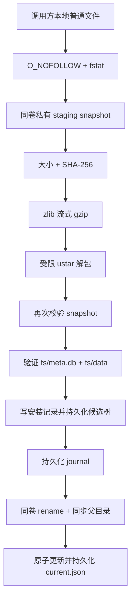

# RootFS 安全方案

[简体中文](RootFS.md) | [English](en/RootFS.md) | [文档中心](README.md)

RootFS 是 PocketRoot 的外部供应链输入，不是普通测试 fixture。仓库提交的是不可变清单、校验和安全安装代码，不提交、镜像或默认打包 RootFS 二进制。

> [!WARNING]
> 固定 v0.3.3 归档已有可复现 package inventory、SPDX SBOM、默认配置证据、完整覆盖 inventory 的源码获取清单、10/10 origin（130 个规范化 aports 条目与 9 个上游 distfile）的对应源码候选材料工程复核，以及 78 个初始候选和 138 个外置 LICENSE/NOTICE payload 的 checksum-bound 工程复核结果；7 个 origin 的许可证候选材料工程项已关闭，只有缺少上游 MIT grant/版权声明的 `alpine-keys` 仍未决。历史 builder 源码已定位，但固定发布归档的精确重建环境和重建仍未验证；独立的 schema-v4 后继候选已通过同 host 跨调用复现，但不替换当前 pin，也不构成发布授权。完整 NOTICE、法律复核、对应源码提供与交付批准尚未闭环。以下 URL 与命令用于审计和本地开发，不构成公开再分发授权。应用必须先完成自己的法律与发行审查。

## 1. 固定清单

`PocketRootRootFSArtifactManifest.ishEmbedV0_3_3` 记录：

| 字段 | 值 |
| --- | --- |
| 版本 | `v0.3.3` |
| 架构 | `arm64` |
| 格式 | iSH `fakefs tar.gz` |
| Guest | Alpine `3.19.1 aarch64` |
| 上游 URL | `https://github.com/Lolendor/ish-arm64-pkg/releases/download/v0.3.3/fs.tar.gz` |
| 压缩大小 | `6,581,376` 字节 |
| 展开 tar 大小 | `18,838,016` 字节 |
| SHA-256 | `be0f3c133f78f28b023288459b33dc28fa253a6ef29f7123bc5f3892edf90ad4` |

`downloadURL` 只是清单元数据。`PocketRootRootFSInstaller` 和组合 factory 都不会读取它或发起下载。

更完整的来源、上游 commit 和许可证事实见[上游依赖清单](UpstreamDependencies.md)。

## 2. 资产所有权边界

调用方负责：

- 决定是否允许网络获取；
- 取得合法、经过审核的 archive；
- 把 archive 放入 App 可访问、且位于受管 `rootfs/` 树之外的本地路径；
- 处理用户同意、缓存、删除和数据保留策略；
- 确认许可证、NOTICE、对应源码与 SBOM；
- 在 manifest 变更时重新审核。

PocketRoot 负责：

- 确认输入是本地普通文件；
- 固定大小和 SHA-256；
- 把调用方路径隔离成私有 snapshot；
- 安全解包；
- 校验 fakefs 布局；
- 版本化、journal 保护的同卷 promotion；
- 复用、可回滚替换与中断恢复；
- 提供串行、no-follow、幂等的整个受管 RootFS 删除入口。

PocketRoot 不负责：

- 下载、更新或选择最新版本；
- 证明调用方拥有再分发权；
- 对 archive 内每个 guest 文件单独签名；
- 在每次安装时执行 SQLite `integrity_check`；
- 完成 VM 数据迁移、用户数据备份或按版本选择性清理。

## 3. 本地获取与独立验证

仅在完成资产使用审查后，开发者可以把文件下载到仓库外的本地路径：

```bash
ROOTFS_ARCHIVE=/absolute/path/outside-the-repository/fs-v0.3.3.tar.gz

curl --fail --location --retry 3 \
  --output "$ROOTFS_ARCHIVE" \
  "https://github.com/Lolendor/ish-arm64-pkg/releases/download/v0.3.3/fs.tar.gz"

test "$(stat -f '%z' "$ROOTFS_ARCHIVE")" = "6581376"

printf '%s  %s\n' \
  'be0f3c133f78f28b023288459b33dc28fa253a6ef29f7123bc5f3892edf90ad4' \
  "$ROOTFS_ARCHIVE" \
  | shasum -a 256 --check
```

仓库中的 [`Compliance/RootFS/v0.3.3`](../Compliance/RootFS/v0.3.3/README.md)
包含从这个精确 archive 生成的 15 个二进制包清单、10 个 source origin、SPDX 2.3
JSON SBOM、声明许可证清单、attribution inventory、`apk`/repository/DNS 配置快照、
输入摘要和固定源码获取清单。生成器先验证大小与 SHA-256，再只读取固定的小型
元数据成员：

```bash
ruby Scripts/generate-rootfs-compliance.rb \
  --archive "$ROOTFS_ARCHIVE" \
  --check

ruby Scripts/rootfs-rebuild-delivery-evidence.rb
```

`REBUILD-ENVIRONMENT-REVIEW.json` 明确区分两种结论：v0.3.3 历史源码可定位，
但旧脚本没有固定下载输入摘要、host `fakefsify` 和完整 toolchain receipt，因此
无法声明已精确重建发布归档；上游合并提交 `4755a00` 所含源码树的后继候选，在
两次独立调用（每次内部双构建）中得到相同的
`445d41bbe9f8b1584ba8a4cac05300633e446763aa8a17e690c92b91dca03042`
归档。两次 host `fakefsify` 字节不同而源码 provenance 相同，差异保存在外部环境
receipt 中，RootFS 内容保持一致。这只验证同一 host 上的后继 recipe，不验证
跨 host/OS，也不允许替换、提交或发布 RootFS。

`SOURCE-DELIVERY-INVENTORY.json` 把历史与后继 builder、固定 Alpine 输入、
对应源码材料和修改披露列成 5 个交付单元。该清单完整不等于材料已经生成或可以
交付；仓库现在有统一的仓库外候选 materializer，但 checked-in 状态不声称某个
候选包已经材料化。完整 LICENSE/NOTICE、source offer、法律审查和再分发批准仍
保持关闭。

源码清单与 `CORRESPONDING-SOURCE-REVIEW-RESULTS.json` 可独立校验，也可在
仓库外生成对应源码候选目录：

```bash
ruby Scripts/prepare-rootfs-source-bundle.rb --validate-only

ruby Scripts/prepare-rootfs-source-bundle.rb \
  --output /absolute/new/path/outside-the-repository/rootfs-v0.3.3-corresponding-source-candidate

ruby Scripts/prepare-rootfs-source-bundle.rb \
  --verify /absolute/new/path/outside-the-repository/rootfs-v0.3.3-corresponding-source-candidate
```

已有候选 bundle 或同布局的仓库外只读缓存可用于离线重建，不降低任何固定校验：

```bash
ruby Scripts/prepare-rootfs-source-bundle.rb \
  --download-cache /absolute/existing/rootfs-v0.3.3-corresponding-source-candidate \
  --output /absolute/new/path/outside-the-repository/rootfs-v0.3.3-corresponding-source-candidate
```

缓存必须提供 `downloads/aports/<source-origin>.tar.gz` 和
`distfiles/<source-origin>/<filename>`。脚本拒绝 symlink、特殊/缺失文件、仓库内
缓存及输入/输出重叠，逐项限制大小并核对 SHA-512；aports 仍会重新解包并校验规范化
tree identity。缓存不构成来源批准，也不会改变 receipt 的固定上游来源。
receipt 会明确标记缓存获取并记录缓存内相对路径，不会伪称访问了某个上游 URL；
固定上游来源仍保留在 `SOURCE-ACQUISITION.json`。
receipt schema v3 除强制包含该模式外，还绑定 `SOURCE-INVENTORY.json`、
`CORRESPONDING-SOURCE-REVIEW-RESULTS.json`、候选材料工程状态及全部未解除门禁。
旧 v1/v2 source-review 可继续作为只读 `--download-cache`，但不能直接通过
`--verify`；必须重新生成 v3 候选 bundle。

规范化 aports 目录身份覆盖条目类型、路径、普通文件权限位和内容摘要；物化时会保留
这些权限位，`--verify` 会再次校验。

在对应源码候选目录验证通过后，可把固定的 78 个候选许可证/attribution 文件
提取到另一个仓库外目录：

```bash
ruby Scripts/prepare-rootfs-license-review.rb --validate-only

ruby Scripts/prepare-rootfs-license-review.rb \
  --source-bundle /absolute/new/path/outside-the-repository/rootfs-v0.3.3-corresponding-source-candidate \
  --output /absolute/new/path/outside-the-repository/rootfs-v0.3.3-license-review

ruby Scripts/prepare-rootfs-license-review.rb \
  --source-bundle /absolute/new/path/outside-the-repository/rootfs-v0.3.3-corresponding-source-candidate \
  --verify /absolute/new/path/outside-the-repository/rootfs-v0.3.3-license-review

ruby Scripts/rootfs-license-review-results.rb
```

脚本固定并校验 10 个 aports source snapshot 和 9 个 upstream distfile，不执行
`APKBUILD`；`--verify` 会复核普通文件摘要、目录集合和符号链接目标。脚本不向 App、
Git 或 CI artifact 自动添加输出。这完成的是可复现的工程获取流程。archive 内没有
随附可识别的 LICENSE/COPYING/NOTICE 文件。候选工具会核对提取文件的大小、
SHA-256、精确路径集合与无链接/特殊节点边界。固定结果清单记录 78/78 个候选均已
工程复核，其中 `libc-dev`、`zlib` 的索引项已关闭，另外 8 个 source origin 仍有
未决项；对应源码候选材料的 10/10 origin 工程复核已经完成，但输出仍不能直接
视为完整 NOTICE、经批准的对应源码交付或源码提供承诺。

BusyBox 的最后一批候选由固定 distfile、按 `APKBUILD` 顺序应用的 33 个补丁和
固定配置共同确定。补丁后配置只发生时间戳变化；dry-run 构建图包含 487 个编译
单元和 562 文件递归 include 闭包，并从中固定 41 份仍含独立第三方条款或
provenance 的文件。连同已有材料，BusyBox 现有 60 份 checksum-bound 证据；
这关闭候选材料工程项，但不解除法律、对应源码或发行门禁。

剩余 8 个 origin 的外置 LICENSE/NOTICE 候选包清单还固定了 13 份远端许可证/
attribution 材料与 47 份 aports 补充文件。清单可独立校验；实际物化和复验必须
同时提供上面已经验证的两个仓库外目录：

```bash
ruby Scripts/rootfs-license-notice-candidates.rb
ruby Scripts/rootfs-license-notice-review-results.rb
ruby Scripts/prepare-rootfs-license-notice-bundle.rb --validate-only

ruby Scripts/prepare-rootfs-license-notice-bundle.rb \
  --source-bundle /absolute/new/path/outside-the-repository/rootfs-v0.3.3-corresponding-source-candidate \
  --license-review /absolute/new/path/outside-the-repository/rootfs-v0.3.3-license-review \
  --output /absolute/new/path/outside-the-repository/rootfs-v0.3.3-license-notice-candidates

ruby Scripts/prepare-rootfs-license-notice-bundle.rb \
  --source-bundle /absolute/new/path/outside-the-repository/rootfs-v0.3.3-corresponding-source-candidate \
  --license-review /absolute/new/path/outside-the-repository/rootfs-v0.3.3-license-review \
  --verify /absolute/new/path/outside-the-repository/rootfs-v0.3.3-license-notice-candidates

ruby Scripts/rootfs-license-notice-review-results.rb \
  --bundle /absolute/new/path/outside-the-repository/rootfs-v0.3.3-license-notice-candidates
```

两个候选目录通过独立 verifier 后，可与固定 builder checkout、Alpine 输入和
修改披露组装为一个仓库外交付候选目录。builder 必须位于精确 revision，所有递归
gitlink 必须已初始化且匹配；工具只从 Git object 生成按 commit 内容寻址的
deterministic tar，不复制 `.git` 或未跟踪文件。共享 submodule 只保存一次，tar
也避免大小写不敏感 host 覆盖 Linux 中仅大小写不同的路径：

```bash
ruby Scripts/prepare-rootfs-delivery-candidate.rb --validate-only

ruby Scripts/prepare-rootfs-delivery-candidate.rb \
  --historical-builder /absolute/path/ish-arm64-pkg-v0.3.3 \
  --successor-builder /absolute/path/ish-arm64-pkg-successor \
  --alpine-minirootfs /absolute/path/alpine-minirootfs-3.19.1-aarch64.tar.gz \
  --source-bundle /absolute/path/rootfs-v0.3.3-corresponding-source-candidate \
  --license-notice-bundle /absolute/path/rootfs-v0.3.3-license-notice-candidates \
  --license-review-bundle /absolute/path/rootfs-v0.3.3-license-review \
  --output /absolute/new/path/rootfs-v0.3.3-delivery-candidate

ruby Scripts/prepare-rootfs-delivery-candidate.rb \
  --verify /absolute/new/path/rootfs-v0.3.3-delivery-candidate
```

统一候选包含两套 builder 的递归源码 tar、固定 Alpine minirootfs、对应源码、
license-review evidence 与 LICENSE/NOTICE 候选、修改说明、输入证据、receipt、
typed tree 和 `SHA256SUMS`。独立 `--verify` 会从候选内部重新执行两个下层 bundle
verifier，并先要求候选中的 9 份 evidence 与当前 checkout 已提交的 canonical
evidence 逐字节一致；`--verify` 不接受替代 evidence 路径。随后再检查 Git
object、完整路径/类型/模式和摘要。生成和复验均强制
`sourceOfferPrepared=false`、`legalReviewApproved=false`、
`redistributionApproved=false` 与 `distributionAuthorized=false`。该目录不能
作为公开 artifact、源码提供承诺或可发布 RootFS 的授权依据。

工具对远端材料强制 HTTPS、重定向次数、响应大小、固定字节数与 SHA-256，并原子
创建输出。结果清单把工程复核绑定到精确的 138 文件 payload tree；复验器拒绝路径
漂移、符号链接、特殊节点、已知摘要漂移和 tree digest 漂移。
`alpine-baselayout`、`apk-tools`、`busybox`、`ca-certificates`、`musl`、
`openssl` 与 `pax-utils` 的候选材料工程项已关闭；`alpine-keys` 仍缺少上游
MIT grant 与版权声明。候选 NOTICE 和 receipt 不代表法律审查或发行批准。

不要把归档放入 `Sources/PocketRootResources/Resources`、Demo resources 或 Git LFS。合规完成前，`PocketRootBundledRootFSProvider` 的资源查找预期返回 `nil`。

把 Files/document picker 或受控下载结果复制进 App sandbox，并生成
`localReviewedArchiveURL` 的完整 Swift 示例见[应用接入指南](IntegrationGuide.md#把归档送入-app-沙箱)。

## 4. 公共 API

### 通过组合 factory

推荐应用路径：

```swift
let prepared = try await PocketRootIshSystemFactory.prepareSystem(
    archiveURL: localReviewedArchiveURL,
    applicationSupportURL: applicationSupportURL
)

print(prepared.installation.version)
print(prepared.installation.rootFSURL)
print(prepared.installation.reusedExistingInstallation)
```

### 只使用安装器

不需要立即创建 runtime 时：

```swift
import PocketRootResources

let installer = PocketRootRootFSInstaller(
    baseDirectoryURL: applicationSupportURL,
    manifest: .ishEmbedV0_3_3
)

let installation = try await installer.prepareArchive(
    at: localReviewedArchiveURL
)
```

`baseDirectoryURL` 必须是调用方已经创建的真实本地目录。installer 会创建并持久化其下的
`rootfs/`，但不会递归创建并承诺未知祖先目录的掉电持久性。

### Bundled provider

`PocketRootBundledRootFSProvider` 只查找 `Bundle.module` 中明确加入的资源。当前仓库没有 archive，因此：

- `isRootFSBundled == false`；
- `rootFSArchiveURL() == nil`；
- `prepareRootFS` 抛出 `resourceMissing`。

只有发行审查通过、清单和合规材料一并更新后，才能改变这个行为。

## 5. 威胁模型

安装器防护的主要风险：

| 风险 | 防护 |
| --- | --- |
| 调用方传入 symlink、FIFO 或设备文件 | `O_NOFOLLOW` + `fstat` regular-file 检查 |
| 校验后原路径被替换 | 只解包私有 snapshot，并在前后校验同一文件 |
| archive 过大导致磁盘/内存耗尽 | 压缩、展开、payload 和 entry count 上限 |
| 新安装峰值空间明显不足 | staging 前按 snapshot、临时 tar、payload 和 16 MiB 余量预检同卷容量 |
| 中途 ENOSPC 留下半文件或破坏旧安装 | snapshot/gzip/tar/record/journal/current 故障矩阵、staging cleanup 和 promotion rollback |
| 突然掉电导致 journal、rename 与 current 顺序漂移 | 候选树、记录文件和相关父目录的显式持久化屏障；按 journal/final/backup 推断恢复 |
| tar 绝对路径或 `..` 逃逸 | UTF-8 相对路径规范化与 destination containment |
| symlink/hardlink 绕过目标目录 | 拒绝 link 和特殊 entry type |
| 重复文件或目录覆盖 | 隐式父目录也登记为 archive target；拒绝后续映射到同一路径或同一文件系统目标的重复 entry |
| 候选布局不是 iSH fakefs | 要求真实 `fs/meta.db` 与 `fs/data/` |
| 替换中途失败破坏旧版本 | persistent transaction + rollback |
| 进程在 rename 中途退出 | 下次准备时读取 journal，根据 final 是否匹配预期、backup 是否存在以及旧安装事实完成 commit 或恢复 |
| 多任务同时安装 | 进程级串行 installation executor |

不在当前保证范围：

- 恶意但哈希已经被错误清单认可的内容；
- guest 内运行时漏洞；
- App 自己下载阶段的 TLS、认证或缓存策略；
- 真机存储压力、强制断电实证、jetsam 与持续内存峰值；
- 许可证合规；
- 用户生成 VM 数据的迁移与备份。

## 6. 安装步骤



### 输入 snapshot

- 仅在目标版本不能安全复用时预检容量；有效现有版本不要求重新安装空间。
- 新安装预算为压缩 archive 上限、两倍展开上限和 16 MiB；自定义 extractor 比
  manifest 更宽时采用两者较大的展开上限。两份展开预算分别覆盖 gzip 生成的临时 tar，
  以及 tar 仍存在时写出的 payload。
- 容量不足返回 `insufficientStorage(requiredBytes:availableBytes:)`，且发生在
  本次新 staging 或 replacement transaction 创建前。
- 源文件只打开一次。
- 目标使用 exclusive create。
- snapshot 权限仅允许当前用户。
- 复制时检查 archive byte ceiling 和任务取消。
- staging 与最终目录位于同一 base volume。

### 解包边界

gzip 层使用 zlib streaming。tar 层只支持项目需要的 ustar subset：

- 普通文件；
- 目录；
- 可忽略内容的 PAX 扩展记录。

拒绝：

- 符号链接；
- 硬链接；
- character/block device；
- FIFO；
- 绝对路径；
- 路径中的 `.` 或 `..`；
- 重复目标；
- header checksum 错误；
- 非 UTF-8 路径；
- 超出条目、payload 或展开大小上限。

### fakefs 校验

最终 archive 顶层必须存在 `fs/`：

```text
fs/
├── meta.db    # 真实普通文件
└── data/      # 真实目录
```

root、`meta.db`、`data/` 都不能是 symlink。完整 guest 内容由 archive SHA-256 保证，不逐文件重新散列。

安装器验证 `extracted/fs` 后，把这个 `fs/` 目录本身作为候选提升到
`rootfs/<version>`。因此 `fs/` 是归档格式的一部分，不会成为最终安装中的额外目录层。

## 7. 存储和复用

```text
applicationSupportURL/
└── rootfs/
    ├── current.json
    ├── .installing-<uuid>/
    ├── .replacement-transaction/
    │   ├── journal.json
    │   └── previous/
    └── v0.3.3/
        ├── .pocketroot-rootfs.json
        ├── meta.db
        └── data/
```

复用需要同时满足：

- 版本目录存在；
- fakefs 布局仍有效；
- 版本内安装记录与 manifest 匹配。

`current.json` 只是当前版本索引，不参与判断版本目录本身是否可复用。它缺失、内容不匹配
或指向其他版本时，只要目标版本目录及其安装记录有效，installer 仍会复用并在返回前原子
重写 `current.json`。

如果版本内容损坏或版本内记录漂移，installer 从新 snapshot 生成候选并替换。promotion
失败时回滚到最后一个旧版本，并恢复 promotion 开始前的 `current.json` 数据状态。

容量预检读取 `rootfs/` 所在卷的 important-usage 可用容量。它防止已知 manifest 在明显
空间不足时开始写入，但不预留空间；其他进程仍可能在预检后消耗容量。因此中途文件系统
错误仍依赖 staging cleanup、promotion rollback 和下次启动 recovery。确定性 ENOSPC
注入覆盖 snapshot、gzip 部分 tar、tar payload、安装记录、journal 和 current record；
每个失败点都验证旧安装和原始 `current.json` 保持不变，且 staging/transaction 不残留。

## 8. 中断恢复

replacement journal **不记录 phase**。它保存目标版本、预期安装记录、promotion 开始时是否
存在旧安装，以及旧 `current.json` 的原始数据。下次 `prepareArchive` 在清理 staging 之前，
根据 final 是否匹配预期记录、backup 是否存在以及旧安装事实推断恢复动作：

- final 与预期安装记录匹配 → 候选 rename 已完成，重写 `current.json` 并删除 transaction；
- final 无效且 `previous/` 存在 → 移除无效 final，把 backup rename 回 final，并恢复旧 current 数据；
- journal 声明曾有旧安装但没有 backup → 第一次 rename 尚未完成，要求旧安装仍在 final，再恢复旧 current 数据；
- 原本没有旧安装且 final 无效 → 移除残留 final，并恢复或删除 current record。

transaction 目录存在但 journal 文件尚未写入时，不会有破坏性 rename；这种无 journal 的残留
可直接清理。恢复完成后再清理 `previous/`、journal 与 transaction 目录。

恢复操作本身也要求路径保持在 installation root 内，并避免跟随 symlink。各次同卷 rename
和 JSON 原子写入分别具备原子性，但多步 promotion 整体不是单次原子替换；安全性来自先写
journal、失败回滚与下次准备时的状态推断恢复。

promotion 前，installer 从叶到根对候选树的普通文件执行 `F_FULLFSYNC`（文件系统不支持时
回退 `fsync`），再同步目录。journal 和 `current.json` 通过私有临时文件完整写入、同步、
原子 rename 和父目录同步提交；每次跨目录 rename 后同步源、目标父目录。顺序保证 journal
在破坏性 rename 前持久化，候选内容在成为 final 前持久化，`current.json` 在清理 transaction
前持久化。rollback 和 recovery 的 rename、记录恢复与删除同样同步相关父目录。

确定性 fault matrix 覆盖候选树、journal 文件/目录、旧版本 rename、新候选 rename 和
`current.json` 文件/目录七个持久化屏障；另外构造 journal-only、旧版本已进入 backup、
候选已成为 final 等掉电切点状态，验证能够推断 rollback 或 commit。这建立了实现和宿主
文件系统层面的持久化顺序保证；真机强制断电后的硬件/文件系统实证仍单独维护。

## 9. 测试边界

已覆盖：

- 固定 manifest；
- 大小和 SHA-256；
- 安全解包和恶意 tar entry；
- 安装、复用、损坏替换；
- 不存在的 base directory 拒绝，以及 mode `000` 候选条目持久化后权限保持；
- caller-path replacement；
- bounded copy；
- 并发准备；
- promotion failure rollback；
- 安装前容量不足、刚好满足容量预算，以及低空间升级保持旧版本；
- snapshot、gzip 部分输出、tar payload、安装记录、journal 和 current record 的
  ENOSPC cleanup/rollback；
- 旧安装已移动和候选已提升两个破坏性 checkpoint 的 ENOSPC rollback；
- 七个文件/目录持久化屏障的同步失败 rollback；
- journal-only、backup 和 candidate/final 断电切点的 interrupted rollback/commit；
- 精确 v0.3.3 release asset 集成。

仍需：

- 大归档持续内存峰值；
- 真机 storage pressure；
- 真机强制断电实证；
- 用户 VM 数据迁移；
- 合规材料完整性自动检查。

命令见[测试与验证](Testing.md)。

## 10. 删除、更新与备份规则

底层 `PocketRootRootFSInstaller.removeInstalledRootFS()` 只删除其
`baseDirectoryURL/rootfs` 受管树，不删除调用方 archive；调用方必须先停止所有引用该树
的 runtime/session。正常集成应优先调用
`PocketRootIshWorkspaceHost.removeRootFS()`：ready host 会先有序关闭 PTY 和 native
runtime，过渡态或失败态拒绝删除，避免原生代码仍持有路径时移除文件。删除操作不可撤销，
会同时清除 guest OS、事务记录、旧版本和全部 guest 用户文件；重复调用安全地返回
`false`。

版本升级由新 manifest 驱动并继续使用事务化 promotion。它不会迁移旧 guest 用户数据，
也不会自动删除旧版本目录；当前没有按版本清理 API。产品在升级前必须选择导出/迁移，
或者把“新环境为空”明确呈现给用户。

PocketRoot 不会自动为整个受管树设置 iCloud/iTunes backup exclusion，因为 OS 数据可
重建，而同一树中的用户文件可能不可重建。宿主 App 负责明确备份、数据保留、隐私和
恢复策略。Demo 可以为了可重复测试排除自己的 workspace，但这不是生产默认值。

## 11. 更新 RootFS 制品的规则

任何新版本必须：

1. 固定上游源码 commit 与所有 nested gitlink；
2. 记录原始 Alpine minirootfs 来源和 digest；
3. 审查 build script 与本地修改；
4. 独立计算 archive 大小、展开上限和 SHA-256；
5. 审查 fakefs 布局和 guest package；
6. 更新 manifest 与测试；
7. 运行真实资产测试、最终链接、Simulator 和真机 smoke；
8. 重新生成许可证、NOTICE、对应源码和 SBOM；
9. 更新[上游依赖清单](UpstreamDependencies.md)、[ADR](Decisions/ADR-001-IshEmbed-Feasibility.md)和[发行与合规](ReleaseCompliance.md)。

移动 tag、branch、缓存文件或未记录的本地 archive 都不能替代这个过程。
