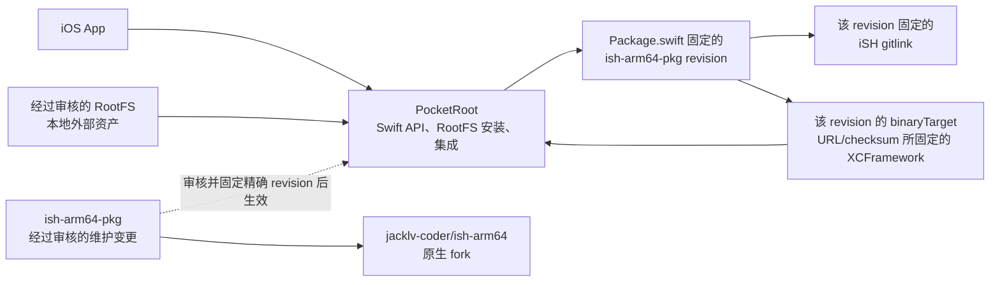
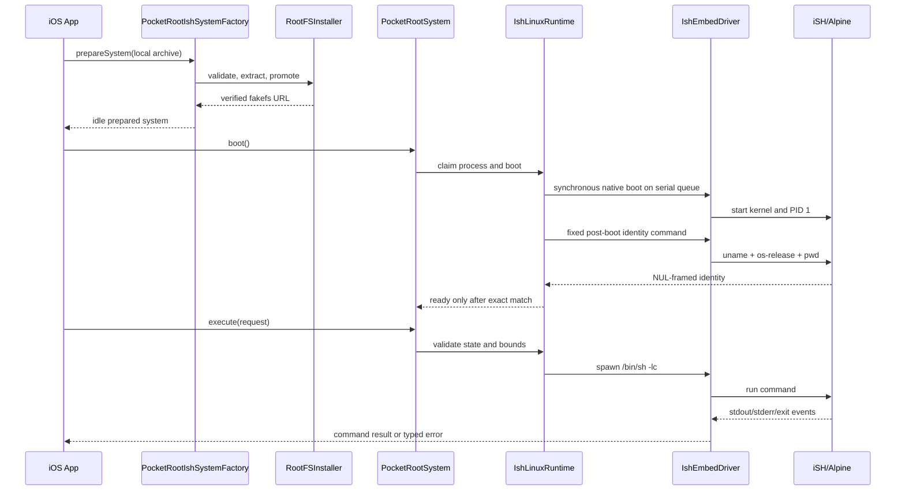

# PocketRoot 技术学习指南

[简体中文](TechnicalGuide.md) | [English](en/TechnicalGuide.md) | [文档中心](README.md)

本文是一份面向后续维护者的学习手册。它不替代各专题文档，而是先建立完整心智模型，再把产品目标、三个仓库、Swift 模块、RootFS、原生运行时、并发、测试和发布流程串起来。

阅读本文后，应能回答：

1. PocketRoot 解决什么问题，明确不做什么？
2. 当前消费链和下一版开发链为什么会涉及 `PocketRoot`、`ish-arm64-pkg` 和 `ish-arm64` 三个仓库？
3. `prepare → boot → execute → shutdown` 分别经过哪些代码？
4. 修改某一层时，应该改哪个仓库、跑哪些测试、更新哪些文档？

动态完成状态以[路线图](Roadmap.md)为准；精确 revision、gitlink、制品大小和哈希以[上游依赖清单](UpstreamDependencies.md)为准。

## 1. 一句话理解 PocketRoot

PocketRoot 是一个最低支持 iOS 18 的 Swift 模块化工程：它在 iOS 沙箱内安装经过固定哈希校验的 ARM64 Linux fakefs，通过实验性的 iSH 原生运行时执行有超时和输出上限的一次性 shell 命令，并为未来的交互式终端保留稳定边界。

它不是：

- 完整的 iSH App 分支；
- 使用 Apple Hypervisor 的通用虚拟机；
- 多内核、多租户的 Linux 服务；
- 自动从网络下载并执行任意 RootFS 的工具；
- 绕过 iOS sandbox、签名、许可证或 App Store 规则的方案。

当前真实 iSH 路径仍是实验能力。默认 `PocketRoot` 产品不会链接 iSH，也不会打包或下载 RootFS。

本文所说的命令“有界”包括从 driver 入口覆盖 finite SPAWN、stdin close 和 event read
的统一 deadline、Swift stdout/stderr 配额、每 session 4 MiB/4096 帧 native 输出积压
和 4 MiB/256 帧 control 总预算。
超时或产品配额超限后的恢复仍要求明确观察到 `EXITED`；无法确认时 runtime 会失败关闭。
8 MiB 二进制 stdout smoke 会跨越 backlog 并逐字节验证持续消费路径；完整 Simulator
smoke 在 shutdown 后读取 `ru_maxrss`，要求生命周期峰值不超过 256 MiB。
deadline 到期后的 terminate 与权威 `EXITED` 确认使用独立的固定有界清理窗口，因此
timeout 不是“调用必须在同一时刻返回”的承诺；真机持续负载和 jetsam 仍需验证。

## 2. 三个仓库和一个外部资产



文字关系如下：

| 层 | 仓库或资产 | 负责内容 | 不负责内容 |
| --- | --- | --- | --- |
| 产品与集成层 | [`jacklv-coder/PocketRoot`](https://github.com/jacklv-coder/PocketRoot) | Swift 公共 API、RootFS 安装、iSH adapter、Demo、集成测试和产品文档 | 构建 iSH 原生二进制 |
| 包装源码层 | [`jacklv-coder/ish-arm64-pkg`](https://github.com/jacklv-coder/ish-arm64-pkg) `fe4ed63` | Swift wrapper、C ABI 源码和 binary target 声明 | 当前声明仍固定已发布 ABI.5 制品 |
| 当前原生制品 | `v0.4.0-abi.5` URL/checksum | 被 PocketRoot 最终链接的 XCFramework | 用户 fork 自托管 prerelease，不含 RootFS |
| 当前原生运行时层 | 上述 package revision 记录的精确 iSH gitlink | iSH 内核、进程、signal、halt 和线程生命周期等底层行为 | 不能用另一个 branch 或本地 checkout 替代 |
| 当前 release commit | [`jacklv-coder/ish-arm64-pkg`](https://github.com/jacklv-coder/ish-arm64-pkg) `bcbf8dd` | manifest-only 固定 ABI.5 URL/checksum | 与 tag 和 Release target 一致；wrapper pin 在其后增加 source-only deadline 修复 |
| Guest 文件系统 | 经许可审查的 `fs.tar.gz` | Alpine 用户空间、fakefs 数据与 guest 工具 | 不存放在 PocketRoot Git 仓库中 |

### 为什么需要修改 `ish-arm64-pkg`

`ish-arm64-pkg` 虽然来源于另一个项目，但 PocketRoot 会编译固定 package revision 的
Swift wrapper，并链接该 revision 的 `Package.swift` 通过 URL/checksum 指定的
XCFramework。当前 pin 指向用户 fork 的 `v0.4.0-abi.5`，并以独立对应源码资产记录
nested iSH、musl 与构建输入。RootFS 仍是单独固定的 parent v0.3.3 资产。

因此原生改动必须按依赖方向推进：

```text
ish-arm64 中修复底层行为
  → ish-arm64-pkg 更新 gitlink、ABI、wrapper、测试和制品
  → 发布可验证的 XCFramework，并在包仓库更新 binaryTarget URL/checksum
  → PocketRoot 更新固定 package revision、adapter 和依赖证据
  → 运行最终链接与 iOS smoke
```

只修改自己的 fork：不会向第三方上游仓库直接提交。三个仓库保持独立，是为了让源码修复、二进制发行和产品集成各自可审查、可回滚。

从 PocketRoot 进入 Linux guest 的完整逻辑链是：

```text
PocketRootIshSystemFactory
→ PocketRootSystem / IshLinuxRuntime / IshEmbedDriver
→ ish-arm64-pkg 的 IshInstance / IshSession
→ C ABI 的 ish_embed_boot / ish_embed_spawn
→ host control writer / event reader
→ framed protocol
→ guest PID 1 supervisor
→ fork/exec、pipe 或 PTY
→ EXITED / ERROR
→ Swift result
```

PocketRoot 负责链路的前半段和产品边界；后半段必须阅读当前 package revision 的对应源码
和 gitlink。当前 wrapper revision `fe4ed63` 在 ABI.5 release commit 后增加 Swift
参数封送与 native admission 共用的绝对 deadline 修复，其 binaryTarget 仍指向已独立
验证的 ABI.5 资产；原生二进制行为以该 Release 的对应源码、哈希和运行验证为证据。
ABI.5 会在 embedded bootstrap 和 guest task 线程解除内部
SIGUSR1 屏蔽，使 guest signal 可打断阻塞中的宿主 syscall；它同时包含 ABI.3 的
固定大小 uname 有界复制和 ABI.2 的 `/proc` 生命周期锁修复。

## 3. PocketRoot 仓库结构

| 路径 | 作用 | 学习重点 |
| --- | --- | --- |
| `Package.swift` | SwiftPM 产品、target 和固定依赖 | 哪些产品安全默认，哪些产品显式启用 iSH |
| `Sources/PocketRootCore/` | 公共模型、actor、runtime protocol | API 与具体 iSH 实现如何解耦 |
| `Sources/PocketRootAgent/` | 有界 model/tool loop | 为什么 agent 位于 Core 之上且不安装 Codex CLI |
| `Sources/PocketRootResources/` | RootFS 清单、验证、解包和安装 | 外部资产如何 fail closed |
| `Sources/CPocketRootArchiveSupport/` | zlib 流式解压窄 C 接口 | Swift/C 边界和展开大小限制 |
| `Sources/PocketRootIshRuntime/` | iSH adapter、driver、串行执行与所有权 | 阻塞原生 API 如何接入 Swift Concurrency |
| `Sources/PocketRootIshRuntimeIntegration/` | RootFS 与 runtime 的组合 factory | 应用真正使用的 `prepareSystem` 入口 |
| `Sources/PocketRootTerminal/` | Terminal 配置与 UIKit 占位 UI | 为什么当前没有直接接 PTY |
| `Demo/PocketRootDemo/` | 安全默认的 UIKit 演示 | UI 与实验运行时保持分离 |
| `Spikes/` | 最终链接与原生 smoke App | 编译成功和真实运行成功的区别 |
| `Tests/` | Swift 单元与集成测试 | 状态、边界、恢复和错误语义 |
| `Scripts/` | bootstrap、构建、文档检查和 smoke | 本地与 CI 的统一入口 |
| `Docs/` | 中文主文档与 `en/` 英文镜像 | 设计事实、门禁和维护规则 |

## 4. Swift 模块如何分层

### 4.1 安全默认层

- `PocketRootCore`：定义 `PocketRootSystem`、命令、结果、状态、错误和 runtime protocol。
- `PocketRootResources`：只处理调用方提供的本地 RootFS，不启动 runtime。
- `PocketRootTerminal`：当前提供 UIKit 终端外壳，不拥有 PTY。
- `PocketRoot`：重新导出以上三个安全模块。

`PocketRootSystem.shared` 使用 `PlaceholderLinuxRuntime`。因此普通应用仅依赖 `PocketRoot` 时，不会因为一次 import 就链接实验性原生二进制。

### 4.2 显式 agent 层

- `PocketRootAgent`：provider-agnostic、有资源上限的 model/tool loop，以及可选 OpenAI Responses transport。
- `PocketRootAgentRuntimeTools`：把 Core command seam 组合为必须经过 policy 与逐次审批的工具。
- 两者都不在默认伞形产品中，不提供 credential storage，也不安装 Codex CLI。

应用需要 agent 时显式选择 `PocketRootAgent`，只有接入命令工具时再选择
`PocketRootAgentRuntimeTools`；详细边界见[轻量 Agent Loop](Agent.md)。

### 4.3 实验运行时层

- `PocketRootIshRuntime`：把 Core 的 `LinuxRuntime` 协议映射到 IshEmbed。
- `PocketRootIshRuntimeIntegration`：先安装 RootFS，再创建绑定该安装的 `PocketRootSystem`。

应用需要真实 Linux 时，显式依赖 `PocketRootIshRuntimeIntegration`，保存 factory 返回的新 system，并把它注入业务对象。factory 不会替换全局 `PocketRootSystem.shared`。

完整产品依赖图见[架构说明](Architecture.md)。

## 5. 一次命令的端到端调用链



### 5.1 `prepareSystem`

入口：`PocketRootIshSystemFactory.prepareSystem`。

它只做三件事：

1. 使用调用方传入的 manifest 校验本地 archive；省略参数时默认使用仓库提交的 `.ishEmbedV0_3_3`；
2. 安全安装或复用 fakefs；
3. 创建绑定该 fakefs、但仍处于 `idle` 的 system。

它不会下载 RootFS，也不会自动 boot。

校验只证明“这些字节与调用方提供的 manifest 一致”。自定义 manifest 本身也必须固定并独立审核；manifest 和 SHA-256 都不证明资产天然安全、已获得分发授权或满足许可证义务。调用方仍负责取得本地文件、审核来源并决定是否有权使用或分发。

### 5.2 `boot`

`PocketRootSystem` 把请求转给 `RuntimeCoordinator`，再进入 `IshLinuxRuntime`。runtime 先同步校验 fakefs 布局；校验通过后，在第一次 suspension 前进入 `.booting`，随后申请进程级所有权，并把同步原生调用送到专用串行队列。布局校验失败发生在状态切换前。

`ready` 表示 native boot 已返回，并且内置 identity gate 已匹配配置的架构、Alpine 身份、可选版本和 guest 工作目录。内置 v0.3.3 RootFS 清单固定为 `aarch64`、`alpine`、`3.19.1` 与所配置工作目录。该门禁不等于每个业务工具、网络或数据都健康，应用仍可在 ready 后追加自己的领域检查。

### 5.3 `execute`

当前一次性命令转换为：

```text
/bin/sh -lc <request.command>
```

因此 `command` 是 shell 字符串，quoting 和注入边界由调用方负责。runtime 还会验证：

- system 已经 ready；
- timeout 大于零且不超过 24 小时；
- stdout/stderr 上限有效；
- 没有第二个一次性命令在途；
- 当前 system 仍拥有全局 iSH 实例。

driver 在入口先创建绝对 deadline，把剩余时间传给 finite `spawn`，然后关闭 stdin 并
分段读取事件。ABI.5 让 SPAWN 从 native API 入口覆盖 instance/spawn gate 与 control
queue admission，并让 stdin close/terminate 使用有界异步接纳。SPAWN 在 deadline
耗尽且未创建 session 时返回标准 timed-out 结果；not-running、protocol 或 broken-pipe
则表示 transport 已无法信任，PocketRoot 会失败关闭 runtime。session 建立后的关闭
stdin、非 timeout read、deadline 和产品输出超限都会请求终止并确认退出。v4 transport 将 supervisor rejection、
broken pipe 与 native backlog overflow 作为类型化错误返回；正常 guest `exit 17` 是合法
结果，负数 `EXITED` 则被视为协议完整性失败。native backlog overflow 会请求有界
session 清理并保留 byte/frame 来源；由于上游 `session.close()` 是 void，Swift 无法确认
清理是否升级为 instance fail-close，因此 PocketRoot 会保守终结 process gate 并要求重启。
同一个请求 deadline 覆盖 driver 入口到 SPAWN、stdin close 与 read loop；deadline
到期后的 terminate/`EXITED` 确认另有固定有界清理窗口。

Swift Task 取消会通过线程安全 token 传到串行 native 队列。若命令尚在队列中，它不会
进入 driver；若已经 spawn，driver 会终止 session，并只在读到可信 `EXITED` 后抛出
`CancellationError`。取消清理无法确认时，原错误替代取消并使 runtime 失败关闭；成功
取消后 runtime 保持 `.ready`，可继续执行命令。取消只能终止进程，不能回滚命令取消前
已经产生的文件、网络或其他 guest 副作用。

### 5.4 `shutdown`

关闭语义取决于 PocketRoot 当前固定的原生制品。学习或调试时，先查 `Package.swift` 和[上游依赖清单](UpstreamDependencies.md)，不要把尚未发布或尚未接入的 fork 代码当成当前产品行为。

当前固定的 `v0.4.0-abi.5` 会停止 supervisor、soft-halt embedded kernel、bounded join
原生线程并返回 Swift。成功后公共状态为 `.terminated`；iSH 的进程级全局状态仍只允许
一次有效 boot/shutdown，因此同一宿主进程不能再次 boot。

## 6. 并发与生命周期模型

PocketRoot 同时面对 Swift actor 和同步 C API，关键不是“多开线程”，而是明确谁拥有状态、谁可以阻塞。

| 机制 | 解决的问题 |
| --- | --- |
| `PocketRootSystem` actor | 隔离应用可见的 system 引用与公共状态 |
| `IshLinuxRuntime` actor | 保护 runtime 状态、命令在途标记和 owner ID |
| `IshProcessGate` actor | 保证一个宿主进程只有一个 iSH owner |
| `BlockingIshExecutor` | 把同步原生调用移出主线程和 Swift cooperative executor |
| `commandInFlight` | 当前阶段禁止两个一次性命令并行 |
| `IshCommandCancellation` | 把 Swift Task 取消桥接到同步 driver，并在确认 guest 退出后再完成取消 |
| timeout/output limits | deadline 约束 session 建立后的 read loop，配额约束 Swift 已收集结果；都不等同于当前 native control path 的端到端时间/内存硬界限 |

典型状态方向：

```text
idle → booting → ready → shuttingDown → terminated
          └──────────────→ failed
```

需要特别理解两点：

1. actor 在 `await` 处可重入，所以生命周期状态必须在第一次 suspension 前更新。
2. `PocketRootSystem.state` 是操作完成后的公共快照，不是 native boot/shutdown 的实时进度流。

底层 IshEmbed 能表达多个 session，不代表 PocketRoot 已经公开交互会话。当前 `IshLinuxRuntime.makeSession` 明确返回未支持，`IshEmbedDriver.execute` 也没有设置 `chrootPath`；PocketRoot 仍只允许一个在途 one-shot。所谓 VM 只是同一 iSH kernel 和 fakefs 下的 chroot 目录树，不是独立 kernel，也不是针对不可信代码的强隔离边界。

## 7. RootFS 不是普通解压目录

iSH 使用 fakefs 表示 Linux 文件系统。相关名称不能混用：

| 名称 | 含义 |
| --- | --- |
| Alpine minirootfs | 构建 guest 的上游输入，不是 PocketRoot installer 直接接受的格式 |
| materialized fakefs | `fakefsify` 等工具生成的 `meta.db + data/` |
| PocketRoot RootFS archive | 带顶层 `fs/` 的 gzip/ustar，内容与调用方提供的 manifest 精确匹配；默认 manifest 来自仓库 |
| installed RootFS | installer promotion 后的版本目录，顶层直接是 `meta.db + data/` |
| guest supervisor | 作为 Linux PID 1 处理 spawn、pipe/PTY 和进程回收的 AArch64 程序 |
| corresponding source | 与 GPL 二进制对应的源码归档；它不等同于、也不包含 RootFS 资产 |

PocketRoot 当前要求安装后的物化根目录至少包含：

```text
rootfs/<version>/
├── meta.db
├── data/
└── .pocketroot-rootfs.json
```

安装流程的核心不变量：

1. 输入必须是本地、普通、非符号链接文件；
2. 先复制到私有同卷 staging snapshot，再验证和解包；
3. 压缩大小、SHA-256、展开大小、条目数和 tar 类型均受限制；
4. 拒绝绝对路径、`..`、符号链接、硬链接和设备节点；
5. 候选布局验证通过后才 promotion；
6. replacement journal 让中断后的下一次启动可以 commit 或 rollback；
7. 失败不得破坏最后一个已验证安装。

RootFS 二进制本身受来源与许可证门禁约束，所以不提交到仓库，PocketRoot 也不负责网络下载。算法与威胁边界见[RootFS 安全方案](RootFS.md)。

原生 package 版本与 RootFS 版本是两条独立版本轴：前者决定 Swift wrapper、C ABI、protocol 和 XCFramework，后者决定 Alpine guest 内容及其 manifest。发布新的 XCFramework 不会自动发布新的 RootFS，二者可以在完成兼容性验证后使用不同版本号。

## 8. 从公开 API 找到实现

| 想追踪的行为 | 从这里开始 | 下一层 |
| --- | --- | --- |
| `boot/execute/shutdown` | `PocketRootSystem.swift` | `RuntimeCoordinator.swift` → `IshLinuxRuntime.swift` |
| 默认系统为什么失败 | `PlaceholderLinuxRuntime.swift` | `Package.swift` 的产品依赖 |
| RootFS manifest | `RootFSArtifactManifest.swift` | `RootFSValidator.swift` |
| 解包规则 | `RootFSGzipTarExtractor.swift` | `CPocketRootArchiveSupport.c` |
| 安装复用与恢复 | `RootFSInstaller.swift` | `Tests/PocketRootResourcesTests/` |
| Swift 到 native | `IshEmbedDriver.swift` | `ish-arm64-pkg` 的 `Sources/IshEmbed/` 与 C ABI |
| 原生 kernel 行为 | `ish-arm64-pkg/third_party/ish` gitlink | `ish-arm64` 对应 commit |
| Demo 页面 | `Demo/PocketRootDemo/` | `project.yml` |
| 原生行为证据 | `Spikes/PocketRootIshRuntimeSmoke/` | `Scripts/run-runtime-smoke.sh`、`Scripts/run-runtime-device-smoke.sh` |

更细的逐方法说明见[实现原理](Implementation.md)。

## 9. 修改什么，就验证什么

| 改动类型 | 主要仓库 | 最低验证 |
| --- | --- | --- |
| UI、公共模型、placeholder | PocketRoot | `./Scripts/test.sh`、`./Scripts/build.sh` |
| SwiftPM 产品或 iOS 基线 | PocketRoot | package tests、Demo build、runtime final link |
| RootFS 解包、安装、恢复 | PocketRoot | Resources tests、真实资产测试、文档检查 |
| iSH Swift adapter | PocketRoot | runtime tests、compile spike、native smoke |
| C ABI、session I/O、supervisor | ish-arm64-pkg | C tests、sanitizers、Swift tests、XCFramework 验证 |
| kernel halt、线程或进程行为 | ish-arm64 + ish-arm64-pkg | 原生回归、重建制品、Simulator 和真机生命周期 |
| dependency revision/checksum | ish-arm64-pkg + PocketRoot | source/asset 校验、两个消费模式、最终链接和 smoke |
| 文档或行为契约 | 对应仓库 | 中英文镜像、链接检查、命令实跑 |

发布顺序不能倒置：PocketRoot 不能先引用一个尚未公开且无法校验的 XCFramework。原生变更先在包仓库通过 CR、CI 和 release 门禁，再由 PocketRoot 固定到不可变输入。

## 10. 本地验证层级

从快到慢执行：

```bash
./Scripts/bootstrap.sh
./Scripts/test.sh
./Scripts/check-docs.sh
./Scripts/build.sh
./Scripts/build-runtime-spike.sh
```

干净 clone 建议先运行 `bootstrap.sh`：`build.sh` 需要由 `project.yml` 生成、但不提交到 Git 的 Xcode 工程。`build-runtime-spike.sh` 会自行重新生成工程，但仍要求 XcodeGen 和依赖环境可用。已完成 bootstrap 且工程没有配置变化时，可以从后续检查开始。

有经过审核且精确匹配 manifest 的 RootFS 时，再运行：

```bash
POCKETROOT_ROOTFS_ARCHIVE=/absolute/path/to/fs.tar.gz \
  swift test --filter testPinnedReleaseArchiveWhenProvidedByEnvironment

POCKETROOT_ROOTFS_ARCHIVE=/absolute/path/to/fs.tar.gz \
  ./Scripts/run-runtime-smoke.sh
```

这些层级分别回答：

- 单元逻辑是否正确？
- 文档是否成对且链接有效？
- 默认 Demo 是否能构建？
- 实验依赖图是否能生成最终 iOS 可执行文件？
- 固定真实资产能否被安全安装？
- iSH guest 能否在 iOS Simulator 完成真实生命周期？

详细环境和覆盖矩阵见[测试与验证](Testing.md)。

## 11. 推荐学习路线

### 第一步：建立产品边界

依次阅读：

1. [产品规划](ProductPlan.md)
2. [路线图](Roadmap.md)
3. [发行与合规](ReleaseCompliance.md)

目标是先知道“为什么暂时不能公开发行”，避免把实验成功误解为生产可用。

### 第二步：只看安全默认路径

1. 按[快速开始](GettingStarted.md)先检查 Xcode、Swift、Homebrew 与 XcodeGen，再运行 `./Scripts/bootstrap.sh` 和 `./Scripts/test.sh`；`bootstrap.sh` 在缺少 XcodeGen 时可能通过 Homebrew 安装它；
2. 从 `PocketRootSystem.shared` 追到 `PlaceholderLinuxRuntime`；
3. 运行 Demo，观察 placeholder 状态；
4. 阅读 `Package.swift`，确认默认产品没有 iSH 依赖。

### 第三步：学习 RootFS

1. 阅读 manifest、validator、extractor、installer；
2. 在 Resources tests 中找损坏 archive、路径逃逸、复用和中断恢复用例；
3. 用合成 fixture 理解算法，不需要真实 RootFS；
4. 最后再阅读真实资产门禁。

### 第四步：追踪一次命令

从 `PocketRootIshSystemFactory` 开始，依次进入 `PocketRootSystem`、`IshLinuxRuntime`、`IshEmbedDriver`，重点观察每次 `await` 前后的状态变化、串行队列和 session 清理。

### 第五步：理解原生供应链

1. 查看 PocketRoot `Package.swift` 固定的 package revision；
2. 查看 ish-arm64-pkg 的 `third_party/ish` gitlink；
3. 对照 ish-arm64 commit；
4. 查看 XCFramework checksum、slice、minimum OS 和 license；
5. 理解源码 commit 与 release asset 为什么必须一一对应。

### 第六步：做一个低风险练习

优先选择增加一个 Swift 单元测试、补充一条错误说明或改进 Demo 展示。完成后跑对应测试和文档检查，再观察 Git diff。不要把第一次练习放在 shutdown、signal、文件系统 promotion 或发布脚本上。

## 12. 如何判断文档是否仍然可信

遇到冲突时按以下优先级核对：

1. 当前 checkout 的代码、`Package.swift`、`Package.resolved` 和 gitlink；
2. 制品自身的 checksum、架构与 load commands；
3. [上游依赖清单](UpstreamDependencies.md)中的固定事实；
4. [路线图](Roadmap.md)中的动态状态；
5. 本文和 README 中的学习性摘要。

不要用尚未合并的 PR、另一个本地 worktree 或计划中的 release 替代当前仓库事实。行为、API、依赖、哈希或门禁变化时，中文主文档和英文镜像必须在同一个 PR 中更新。

## 13. 术语速查

| 术语 | 含义 |
| --- | --- |
| host | PocketRoot 所在的 iOS App 进程 |
| guest | iSH 内运行的 Alpine Linux 用户空间 |
| fakefs | iSH 使用的 `meta.db + data/` 文件系统表示 |
| RootFS archive | 调用方提供、经过固定哈希校验的 fakefs 归档 |
| wrapper | 把 C ABI 映射为 Swift API 的 ish-arm64-pkg 代码 |
| XCFramework | SwiftPM 消费的预编译 iOS device/simulator 制品 |
| gitlink | 父仓库记录的 submodule 精确 commit |
| one-shot command | 启动进程、把输出收集到配置的 Swift 结果配额内并等待退出的一次性命令 |
| process gate | 防止多个 system 同时拥有进程级 iSH singleton 的门禁 |
| final link | 生成完整 App 可执行文件，而不只是编译静态库 |
| smoke | 使用真实制品和 RootFS 验证关键生命周期的端到端测试 |

## 14. 延伸阅读

- [架构说明](Architecture.md)：模块、依赖、并发与生命周期的事实源。
- [实现原理](Implementation.md)：逐方法、逐调用链的代码说明。
- [应用接入指南](IntegrationGuide.md)：对外 API 的实际用法。
- [RootFS 安全方案](RootFS.md)：安装算法与威胁边界。
- [测试与验证](Testing.md)：每个测试层级能证明什么。
- [故障排查](Troubleshooting.md)：从症状定位到模块。
- [上游依赖清单](UpstreamDependencies.md)：三个仓库和二进制的不可变身份。
- [ADR-001](Decisions/ADR-001-IshEmbed-Feasibility.md)：采用实验性 IshEmbed 的理由与后果。
