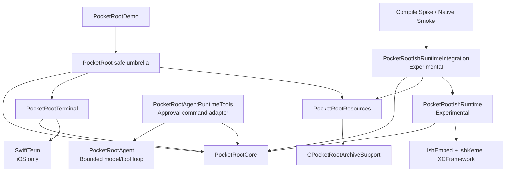
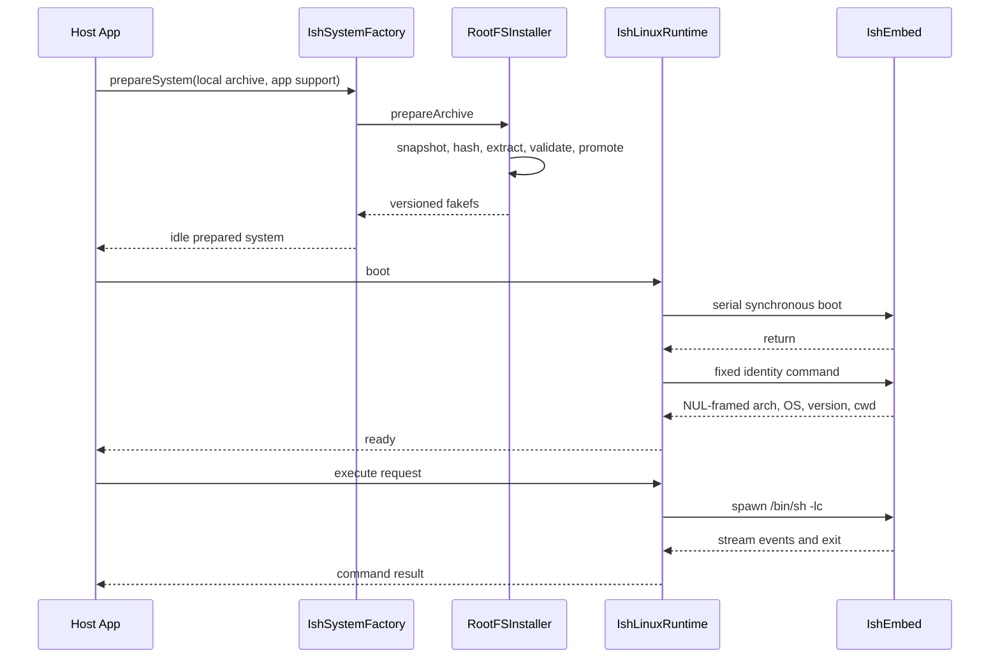
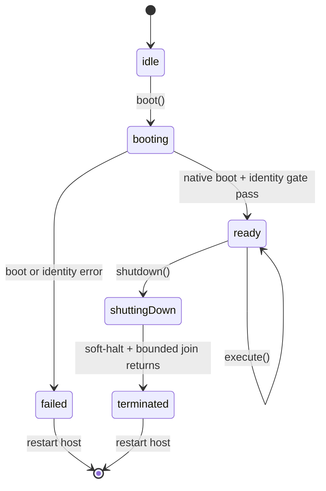

# PocketRoot Architecture

[简体中文](../Architecture.md) | [English](Architecture.md) | [Documentation](README.md)

## Goals

PocketRoot separates reusable Linux capabilities from the UIKit Demo and keeps the high-risk native iSH dependency behind explicit Experimental products.

The design keeps the default dependency safe, Core independent from UIKit and concrete runtimes, RootFS installation separate from boot, synchronous native work off Swift cooperative executors, process-global ownership visible, and terminal UI behind a proven PTY lifecycle.

## Baseline

| Item | Baseline |
| --- | --- |
| App deployment | iOS 18.0 |
| Development | Xcode 16.0+ and iOS 18 SDK |
| Package manifest | Swift 5.10+ |
| Xcode language mode | Swift 5, targeted strict concurrency |
| Native platforms | arm64 iOS device and arm64 Simulator |
| Host-test declaration | macOS 13 only |

The XCFramework has no macOS or x86_64 Simulator slice. The macOS fallback tests adapter contracts only. SwiftPM cannot condition a product dependency on destination architecture, so an App target selecting the Experimental product must exclude x86_64 before linking instead of relying on a runtime feature probe. Native final links and smoke passed with Xcode 16.0 / iOS 18.0 SDK and with the newer validation toolchain.

## Module graph



- Core has no UIKit, Resources, or IshEmbed dependency.
- Terminal depends on Core and links the pinned SwiftTerm revision on iOS only.
- Resources uses a private zlib C target and no runtime.
- Agent is a pure-Swift loop plus optional OpenAI transport outside the safe umbrella, with no runtime dependency.
- AgentRuntimeTools explicitly depends on Agent and Core to compose commands behind policy, per-call approval, and resource bounds.
- IshRuntime depends on Core and conditionally on IshEmbed for iOS.
- IshRuntimeIntegration is the public Resources/runtime composition boundary.
- The umbrella exports Core, Terminal, and Resources only.
- The default Demo links the umbrella; native spikes link the Experimental integration.

## Responsibilities

### PocketRootCore

Public state, configuration, command/result/error model, `PocketRootSystem` actor, runtime and session abstractions, and the safe placeholder.

### PocketRootAgent

A provider-agnostic, non-streaming model/tool loop with bounded turns, calls,
inputs, arguments, and outputs; response/call ID replay rejection; whole-batch
validation; sequential tool execution; cancellation; structured unknown-tool
or ordinary tool-failure feedback; and an optional OpenAI transport. It stores
no credentials and does not install Codex CLI in the RootFS.
See [Lightweight Agent Loop](Agent.md).

### PocketRootAgentRuntimeTools

An explicit product for strict command schemas, tool-specific whole-batch
preflight, cwd/environment/timeout/output bounds, host allow/deny policy,
per-call approval, and bounded UTF-8/Base64 mapping of
`PocketRootSystem.execute` results. It is not in the safe umbrella.

### PocketRootResources

Immutable manifest, regular-file input validation, streaming SHA-256, zlib gzip, constrained ustar extraction, fakefs validation, versioned install, reuse, replacement, rollback, and interrupted-promotion recovery. It never downloads a RootFS.

### CPocketRootArchiveSupport

A private zlib streaming primitive with expanded-byte limits and partial-output cleanup.

### PocketRootIshRuntime

The Experimental mapping from Core's package-scoped runtime contract to pinned
IshEmbed: fakefs preflight, process ownership, serial blocking execution, boot,
bounded one-shot commands, stream/exit/signal mapping, and a returning
single-lifecycle soft shutdown.

### PocketRootIshRuntimeIntegration

`prepareSystem` verifies and materializes a caller archive, aligns RootFS version configuration, and returns an idle prepared system. It never downloads, boots, or replaces `PocketRootSystem.shared`.

### PocketRootTerminal

A SwiftTerm-backed persistent PTY, a NUL-framed guest file browser with bounded
preview, and an optional one-shot fallback that carries the physical `pwd -P`
result instead of trusting mutable `$PWD`. UIKit and SwiftUI presentation
remains MainActor-isolated.

### PocketRoot

The safe umbrella. It intentionally omits `PocketRootAgent` and both
Experimental products.

### PocketRootDemo

A programmatic UIKit shell with System, Terminal, Commands, and Diagnostics stacks. It contains no runtime implementation or RootFS payload.

## End-to-end flow



The caller owns the archive before composition. Install and boot are separate.
Native return alone is not ready: the configured identity gate must match
first. One-shot output is bounded and is not an interactive session. Native
shutdown returns `.terminated`, but the same host process cannot boot again.

## Concurrency

`PocketRootSystem` and `PocketRootRootFSInstaller` are actors. Blocking installation work and native IshEmbed work use dedicated process-wide serial executors.

`IshLinuxRuntime` updates its own internal transient lifecycle state before its
first suspension to close boot/shutdown reentrancy. Public
`PocketRootSystem.state` is different: completed public calls publish only
stable states. A fail-closed command therefore publishes `.failed`, but a
reentrant call cannot leak internal `.booting` / `.shuttingDown` transitions
into the public contract. Each asynchronous refresh carries a monotonically
increasing generation, so an older snapshot cannot resume later and overwrite
a newer observation.

The runtime uses process ownership, pre-suspension lifecycle transitions, one
in-flight command, bounded reads, and Swift result limits. Direct not-running,
protocol, or broken-pipe spawn failures close the process gate. Later
stdin/read/request-timeout/product-overflow failures terminate and require
authoritative `EXITED` confirmation. Wire v4 returns supervisor rejection and
native backlog overflow as typed terminal errors. Guest exit 17 is valid; a
negative `EXITED` is an integrity failure. Supervisor rejection remains
recoverable; native backlog overflow closes the PocketRoot process gate because
the void close ABI cannot prove whether cleanup escalated to instance
fail-close. Native limits include a 4 MiB/4096 frame backlog per session and a
4 MiB/256 frame total control budget. One PocketRoot deadline starts at driver
entry and covers finite SPAWN, stdin close, and event reads. Termination plus
authoritative `EXITED` confirmation after expiry has a separate fixed bounded
cleanup window. One-shot
Swift Task cancellation now terminates the guest and confirms exit before
returning. Interactive sessions use 100 ms read polls, 16 KiB chunks, and a
256-event Swift backlog capped at 4 MiB; newest buffering preserves terminal
`.failed`/`.exited` events. They also use finite native control admission and
bounded termination. Creation is
reserved before its first suspension so shutdown cannot pass an unregistered
native handle. Fatal transport failures close the session and fail the runtime
and process gate closed. Native shutdown is admitted only after every registered
session has produced an authoritative exit and unregistered. An 8 MiB byte-exact binary-stdout smoke crosses the
native backlog and proves continuous consumption. After shutdown, the complete
Simulator smoke reads `ru_maxrss` and requires a lifecycle peak at or below
256 MiB. Physical sustained-load and jetsam behavior remain open.

## Lifecycle

The following diagram is the runtime's internal lifecycle, not a real-time
observation trace of `PocketRootSystem.state`:



Execution requires ready. Active one-shot commands block shutdown; live PTY
sessions are terminated and closed first. Pinned native
shutdown returns `.terminated`; process-global iSH state prevents another boot
in the same host process.

## RootFS storage

```text
applicationSupportURL/
└── rootfs/
    ├── current.json
    ├── .installing-<uuid>/
    ├── .replacement-transaction/
    └── <manifest-version>/
        ├── .pocketroot-rootfs.json
        ├── meta.db
        └── data/
```

The archive contains a top-level `fs/` directory, but the installer promotes
that directory itself. The final `rootfs/<version>` therefore directly contains
`meta.db`, `data/`, and `.pocketroot-rootfs.json`, with no extra `fs/` layer.

Only when the target cannot be reused, the installer preflights same-volume
additional capacity before staging. The budget includes the compressed
snapshot, temporary gzip-output tar, materialized payload, and a 16 MiB
reserve. Rejection does not create a new transaction or modify a valid prior
version for the new install. This is not a reservation; later exhaustion
still relies on cleanup, rollback, and recovery.

Test fault points cover snapshot writes, gzip after partial tar output, tar
payloads, the installation record, the journal, and `current.json`. Any
ENOSPC must remove the current staging/transaction and, once promotion has
started, restore the prior version and current-record bytes.

After validation, an on-disk journal protects a multi-step sequence of
same-volume renames. Each rename and JSON record write is atomic on its own,
but the replacement as a whole is not one atomic operation; it can roll back
on failure and recover after interruption. The journal stores no phase. It
stores the expected record, whether a previous install existed, and the prior
`current.json` bytes; recovery infers commit or rollback from an
expected-final match, backup presence, and the recorded prior-install facts.
Promotion has explicit persistence barriers: candidate files receive
`F_FULLFSYNC`/`fsync` and leaf-first directory synchronization before the
journal is durably committed; both parents are synchronized after every
cross-directory rename; the `current.json` temporary file and its final
directory entry are synchronized before transaction removal. A seven-point
sync-failure matrix plus journal-only, backup, and candidate cut-point states
verify rollback or commit. Physical-device forced-power-cut evidence remains
a separate gate.

Reuse requires a valid version-directory layout and a matching in-directory
installation record. A missing or mismatched `current.json` does not block
reuse; the installer rewrites it before returning.

## Project and validation sources

- `Package.swift`: products, dependencies, and tests.
- `Package.resolved`: exact resolution.
- `project.yml`: Demo and native spike targets.
- Generated `PocketRootDemo.xcodeproj`: not committed.
- CI: host tests, real-asset test, Demo build, and arm64 final links.
- Local smoke: iOS 18 Simulator native behavior.

See [testing](Testing.md) and the [roadmap](Roadmap.md).

## Established and future seams

`PocketRootSession`, live-session ownership, bounded PTY reads, pinned
SwiftTerm bridging, and bounded guest file browsing are implemented.
Application-specific post-boot health plus iPad, VoiceOver, app-transition, and
sustained-device hardening remain.

See [implementation](Implementation.md) for the source-level call paths.
