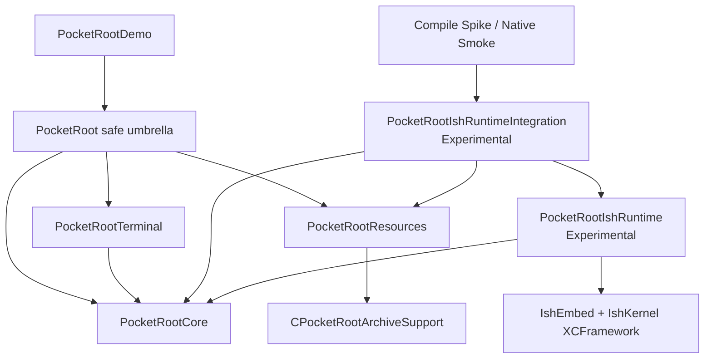
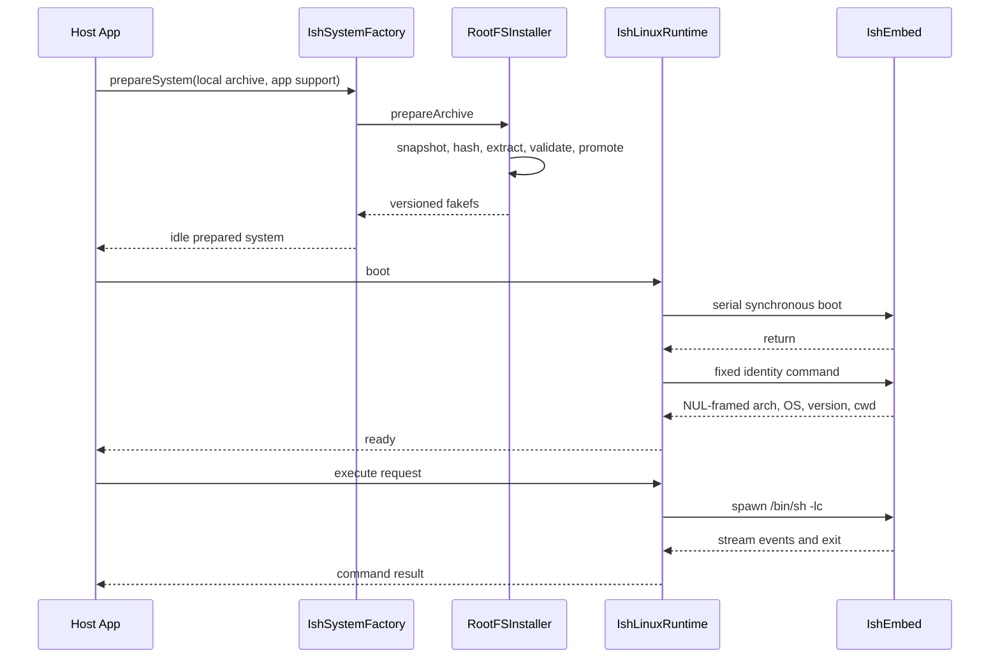
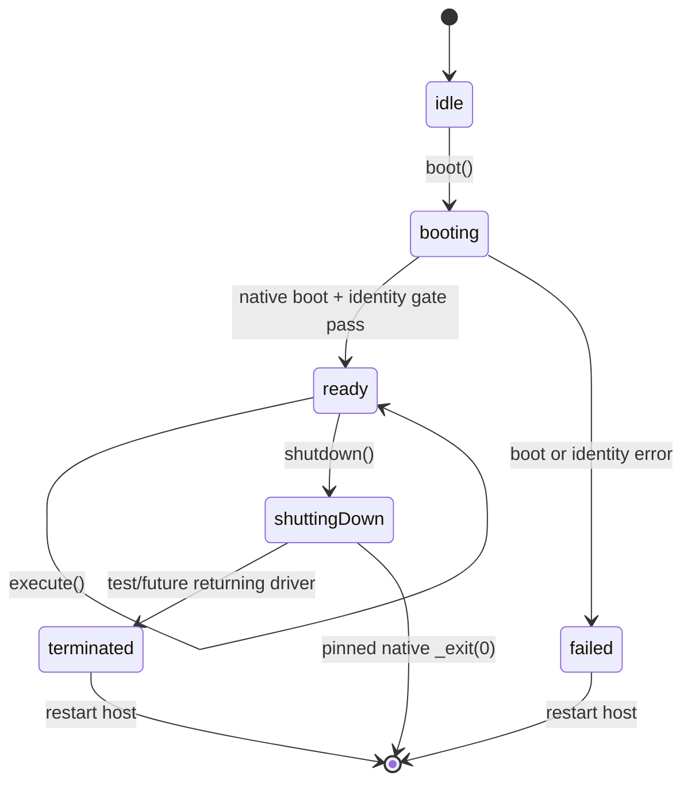

# PocketRoot Architecture

[简体中文](../Architecture.md) | [English](Architecture.md) | [Documentation](README.md)

## Goals

PocketRoot separates reusable Linux capabilities from the UIKit Demo and keeps the high-risk native iSH dependency behind explicit Experimental products.

The design keeps the default dependency safe, Core independent from UIKit and concrete runtimes, RootFS installation separate from boot, synchronous native work off Swift cooperative executors, process-global ownership visible, and terminal UI behind a proven PTY lifecycle.

## Baseline

| Item | Baseline |
| --- | --- |
| App deployment | iOS 18.0 |
| Development | Xcode 16.0+ and iOS 18 SDK |
| Package manifest | Swift 5.10+ |
| Xcode language mode | Swift 5, targeted strict concurrency |
| Native platforms | arm64 iOS device and arm64 Simulator |
| Host-test declaration | macOS 13 only |

The XCFramework has no macOS or x86_64 Simulator slice. The macOS fallback tests adapter contracts only.

## Module graph



- Core has no UIKit, Resources, or IshEmbed dependency.
- Terminal depends on Core.
- Resources uses a private zlib C target and no runtime.
- IshRuntime depends on Core and conditionally on IshEmbed for iOS.
- IshRuntimeIntegration is the public Resources/runtime composition boundary.
- The umbrella exports Core, Terminal, and Resources only.
- The default Demo links the umbrella; native spikes link the Experimental integration.

## Responsibilities

### PocketRootCore

Public state, configuration, command/result/error model, `PocketRootSystem` actor, runtime and session abstractions, and the safe placeholder.

### PocketRootResources

Immutable manifest, regular-file input validation, streaming SHA-256, zlib gzip, constrained ustar extraction, fakefs validation, versioned install, reuse, replacement, rollback, and interrupted-promotion recovery. It never downloads a RootFS.

### CPocketRootArchiveSupport

A private zlib streaming primitive with expanded-byte limits and partial-output cleanup.

### PocketRootIshRuntime

The Experimental mapping from Core's package-scoped runtime contract to pinned IshEmbed: fakefs preflight, process ownership, serial blocking execution, boot, bounded one-shot commands, stream/exit/signal mapping, and process-terminal shutdown.

### PocketRootIshRuntimeIntegration

`prepareSystem` verifies and materializes a caller archive, aligns RootFS version configuration, and returns an idle prepared system. It never downloads, boots, or replaces `PocketRootSystem.shared`.

### PocketRootTerminal

A MainActor-isolated UIKit placeholder contract. It has no SwiftTerm or PTY implementation.

### PocketRoot

The safe umbrella. It intentionally omits both Experimental products.

### PocketRootDemo

A programmatic UIKit shell with System, Terminal, Commands, and Diagnostics stacks. It contains no runtime implementation or RootFS payload.

## End-to-end flow



The caller owns the archive before composition. Install and boot are separate. Native return alone is not ready: the configured identity gate must match first. One-shot output is bounded and is not an interactive session. Native shutdown is omitted from a returning flow because the pinned artifact exits the host process.

## Concurrency

`PocketRootSystem` and `PocketRootRootFSInstaller` are actors. Blocking installation work and native IshEmbed work use dedicated process-wide serial executors.

`IshLinuxRuntime` updates its own internal transient lifecycle state before its
first suspension to close boot/shutdown reentrancy. Public
`PocketRootSystem.state` is different: it refreshes from the coordinator only
after `boot()` / `shutdown()` returns or throws. Internal `.booting` and
`.shuttingDown` transitions are therefore not a public real-time progress feed.

The runtime uses a process ownership gate, lifecycle state transitions before suspension, one in-flight command, bounded native read waits, and independent Swift result limits. The deadline is created only after synchronous `spawn` and `closeStdin` return. In the pinned v0.3.3 native transport, control writes, terminate, and close may still block, and the unread session inbox has no independent ceiling. `execute()` therefore has neither an end-to-end hard time bound nor complete host-process memory backpressure. Swift Task cancellation is not yet a complete native kill contract.

## Lifecycle

The following diagram is the runtime's internal lifecycle, not a real-time
observation trace of `PocketRootSystem.state`:



Execution requires ready. Active commands block shutdown. The pinned native shutdown exits the app, so Swift normally cannot observe terminated or boot again.

## RootFS storage

```text
applicationSupportURL/
└── rootfs/
    ├── current.json
    ├── .installing-<uuid>/
    ├── .replacement-transaction/
    └── <manifest-version>/
        ├── .pocketroot-rootfs.json
        ├── meta.db
        └── data/
```

The archive contains a top-level `fs/` directory, but the installer promotes
that directory itself. The final `rootfs/<version>` therefore directly contains
`meta.db`, `data/`, and `.pocketroot-rootfs.json`, with no extra `fs/` layer.

After validation, a durable journal protects a multi-step sequence of
same-volume renames. Each rename and JSON record write is atomic on its own,
but the replacement as a whole is not one atomic operation; it can roll back
on failure and recover after interruption. The journal stores no phase. It
stores the expected record, whether a previous install existed, and the prior
`current.json` bytes; recovery infers commit or rollback from an
expected-final match, backup presence, and the recorded prior-install facts.

Reuse requires a valid version-directory layout and a matching in-directory
installation record. A missing or mismatched `current.json` does not block
reuse; the installer rewrites it before returning.

## Project and validation sources

- `Package.swift`: products, dependencies, and tests.
- `Package.resolved`: exact resolution.
- `project.yml`: Demo and native spike targets.
- Generated `PocketRootDemo.xcodeproj`: not committed.
- CI: host tests, real-asset test, Demo build, and arm64 final links.
- Local smoke: iOS 18 Simulator native behavior.

See [testing](Testing.md) and the [roadmap](Roadmap.md).

## Future seams

`PocketRootSession`, live-session ownership, bounded PTY reads, `TerminalBridge` to pinned SwiftTerm, application-specific post-boot health, and integration of a soft-shutdown IshEmbed artifact.

See [implementation](Implementation.md) for the source-level call paths.
