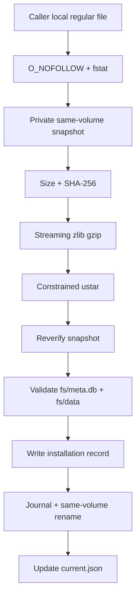

# RootFS Security and Installation

[简体中文](../RootFS.md) | [English](RootFS.md) | [Documentation](README.md)

A RootFS is an external supply-chain input, not a normal fixture. PocketRoot commits immutable metadata and secure install code, not the payload.

> [!WARNING]
> The pinned v0.3.3 archive still has license, NOTICE, corresponding-source, and SBOM gates. The URL and commands below support audit and local development; they do not grant redistribution rights.

## Pinned manifest

| Field | Value |
| --- | --- |
| Version | `v0.3.3` |
| Architecture | `arm64` |
| Format | iSH `fakefs tar.gz` |
| Guest | Alpine `3.19.1 aarch64` |
| URL | `https://github.com/Lolendor/ish-arm64-pkg/releases/download/v0.3.3/fs.tar.gz` |
| Archive size | `6,581,376` bytes |
| Expanded tar size | `18,838,016` bytes |
| SHA-256 | `be0f3c133f78f28b023288459b33dc28fa253a6ef29f7123bc5f3892edf90ad4` |

`downloadURL` is metadata. The installer and composition factory never fetch it.

## Ownership boundary

The caller obtains and authorizes a local archive, owns network and retention policy, and completes license review. PocketRoot verifies a local regular file, snapshots it privately, validates and extracts it, verifies fakefs layout, and manages journal-protected, same-volume promotion, rollback, and recovery.

PocketRoot does not choose the latest version, prove redistribution rights, sign every guest file, run SQLite integrity checks on every install, or currently migrate user VM data.

## Independent local verification

After asset-use review, keep the file outside the repository:

```bash
ROOTFS_ARCHIVE=/absolute/path/outside-the-repository/fs-v0.3.3.tar.gz

curl --fail --location --retry 3 \
  --output "$ROOTFS_ARCHIVE" \
  "https://github.com/Lolendor/ish-arm64-pkg/releases/download/v0.3.3/fs.tar.gz"

test "$(stat -f '%z' "$ROOTFS_ARCHIVE")" = "6581376"

printf '%s  %s\n' \
  'be0f3c133f78f28b023288459b33dc28fa253a6ef29f7123bc5f3892edf90ad4' \
  "$ROOTFS_ARCHIVE" \
  | shasum -a 256 --check
```

Do not put it in package resources, Demo resources, Git, or Git LFS.

See the [integration guide](IntegrationGuide.md#move-the-archive-into-the-app-sandbox)
for a complete Files/document-picker import into an app-owned local URL.

## APIs

Use `PocketRootIshSystemFactory.prepareSystem` for composition, or use `PocketRootRootFSInstaller.prepareArchive` directly when no runtime is needed yet.

`PocketRootBundledRootFSProvider` currently finds no archive: `isRootFSBundled` is false, URL is nil, and preparation throws a typed missing-resource error.

## Threat model

| Risk | Control |
| --- | --- |
| Symlink or special input | `O_NOFOLLOW` plus regular-file `fstat` |
| Caller path replacement | Extract only a private snapshot and verify it twice |
| Resource exhaustion | Compressed, expanded, payload, and entry-count limits |
| Clearly insufficient new-install peak space | Preflight same-volume snapshot, temporary tar, payload, and 16 MiB reserve before staging |
| Mid-operation ENOSPC leaving partial files or damaging the prior install | Snapshot/gzip/tar/record/journal/current fault matrix, staging cleanup, and promotion rollback |
| Tar traversal | UTF-8 relative-path validation and destination containment |
| Links and special nodes | Reject unsupported entry types |
| Duplicate file or directory overwrite | Reject entries that map to the same path or filesystem target |
| Invalid fakefs shape | Require real `fs/meta.db` and `fs/data/` |
| Failed replacement | Persistent transaction and rollback |
| Process interruption | Infer commit or restore from expected-final match, backup presence, and prior-install facts |
| Concurrent preparation | Process-wide serial installation executor |

Out of scope include an incorrectly trusted manifest, guest vulnerabilities,
the app's download policy, physical storage pressure, power-loss durability,
jetsam, compliance, and user-data migration.

## Install flow



Capacity is checked only when the target cannot be safely reused. The new
install budget is the compressed archive limit, twice the larger of the
manifest and custom-extractor expanded limits, and 16 MiB: the extractor
temporarily holds both the gzip-output tar and its materialized payload.
Insufficient capacity returns
`insufficientStorage(requiredBytes:availableBytes:)` before new staging or a
new replacement transaction is created.

The ustar subset accepts regular files, directories, and ignorable PAX content. Parent directories implicitly created for an entry are recorded as archive targets, so a later explicit or filesystem-equivalent directory is rejected. Links, devices, FIFO, absolute/traversal paths, other duplicate file/directory targets, bad checksums, non-UTF-8 names, and exceeded bounds are also rejected.

Archive authenticity comes from the fixed digest. Layout validation does not rehash every guest file or run SQLite integrity checks.

The installer validates `extracted/fs` and promotes that `fs/` directory
itself to `rootfs/<version>`. The `fs/` component belongs to the archive shape;
it is not retained as an extra layer in the final installation.

## Storage and reuse

```text
applicationSupportURL/
└── rootfs/
    ├── current.json
    ├── .installing-<uuid>/
    ├── .replacement-transaction/
    │   ├── journal.json
    │   └── previous/
    └── v0.3.3/
        ├── .pocketroot-rootfs.json
        ├── meta.db
        └── data/
```

Reuse requires the version directory to have a valid fakefs layout and a
matching in-directory installation record. `current.json` is only an index: a
missing or mismatched value does not prevent reuse. The installer rewrites it
atomically before returning the reused installation.

Corrupt layout or an in-directory record mismatch causes candidate
replacement. A failed promotion rolls back to the previous installation and
restores the bytes (or absence) of `current.json` from before promotion.

The preflight reads important-usage capacity from the volume containing
`rootfs/`. It prevents writes when a known manifest clearly cannot fit, but it
does not reserve capacity. Mid-operation exhaustion still depends on staging
cleanup, promotion rollback, and next-start recovery. Tests cover rejection,
exact-budget acceptance and low-space upgrade preservation. Deterministic
ENOSPC injection covers snapshot, partial gzip tar output, tar payload,
installation record, journal, and current record; every point verifies that
the prior install and `current.json` remain unchanged and no staging or
transaction residue remains. Both destructive promotion checkpoints remain
covered as well.

The replacement journal stores **no phase**. It contains the target version,
expected installation record, whether an old installation existed, and the
prior `current.json` bytes. Before stale-staging cleanup, recovery infers the
action from whether final matches the expected record, whether a backup exists,
and what the journal records about a prior installation:

- a final directory matching the expected record completes commit by repairing
  `current.json` and removing the transaction;
- an invalid final with `previous/` restores that backup and the prior current
  data;
- when the journal says an old install existed but no backup exists, recovery
  requires that old install to remain at final, then restores current data;
- when no old install existed and final is invalid, recovery removes the
  residue and restores or removes current.

A transaction directory without its journal file precedes every destructive
rename and is safe to discard. Individual same-volume renames and atomic JSON
writes are atomic on their own, but the multi-step promotion is not one atomic
replacement; safety comes from the on-disk journal, rollback, and inferred
recovery.

The implementation uses atomic single-record writes and same-volume renames,
but does not explicitly `fsync` files or directories. Recovery therefore
covers filesystem state readable after ordinary process interruption; it does
not promise that every write survives sudden power loss. Power-loss claims
still require explicit persistence work and a corresponding fault matrix.

## Update rule

A new RootFS requires immutable source and nested gitlinks, original Alpine digest, build review, independently computed artifact limits/hash, fakefs/package audit, updated manifest and tests, real-asset/final-link/Simulator/physical smoke, regenerated license/NOTICE/source/SBOM material, and updated supply-chain, ADR, and compliance documents.

Moving tags, branches, caches, and unrecorded local archives cannot bypass this process.

See [testing](Testing.md), [upstream dependencies](UpstreamDependencies.md), and [release compliance](ReleaseCompliance.md).
