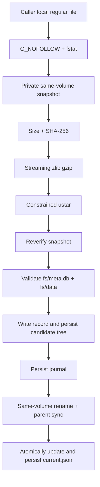

# RootFS Security and Installation

[简体中文](../RootFS.md) | [English](RootFS.md) | [Documentation](README.md)

A RootFS is an external supply-chain input, not a normal fixture. PocketRoot commits immutable metadata and secure install code, not the payload.

> [!WARNING]
> The pinned v0.3.3 archive now has a reproducible package inventory, SPDX SBOM, default-configuration evidence, a source-acquisition manifest covering the complete inventory, checksum-bound corresponding-source candidate-material review of all 10 origins (130 canonical aports entries and nine upstream distfiles), and engineering review of all 78 initial and 138 external LICENSE/NOTICE candidates. Seven origins have no remaining license-candidate material items; only `alpine-keys`, whose upstream package lacks an MIT grant and copyright notice, remains open. The historical builder source is identified, but the pinned release archive's exact build environment and rebuild remain unverified. A separate schema-v4 successor is reproducible across invocations on the same host; it neither replaces the pin nor authorizes distribution. The complete NOTICE set, legal review, source-offer mechanics, corresponding-source delivery approval, and distribution approval remain open.

## Pinned manifest

| Field | Value |
| --- | --- |
| Version | `v0.3.3` |
| Architecture | `arm64` |
| Format | iSH `fakefs tar.gz` |
| Guest | Alpine `3.19.1 aarch64` |
| URL | `https://github.com/Lolendor/ish-arm64-pkg/releases/download/v0.3.3/fs.tar.gz` |
| Archive size | `6,581,376` bytes |
| Expanded tar size | `18,838,016` bytes |
| SHA-256 | `be0f3c133f78f28b023288459b33dc28fa253a6ef29f7123bc5f3892edf90ad4` |

`downloadURL` is metadata. The installer and composition factory never fetch it.

## Ownership boundary

The caller obtains and authorizes a local archive outside the managed `rootfs/` tree, owns network and retention policy, and completes license review. PocketRoot verifies a local regular file, snapshots it privately, validates and extracts it, verifies fakefs layout, manages journal-protected same-volume promotion, rollback, and recovery, and exposes serialized no-follow idempotent removal of the complete managed RootFS tree.

PocketRoot does not choose the latest version, prove redistribution rights, sign every guest file, run SQLite integrity checks on every install, migrate or back up user VM data, or selectively clean individual installed versions.

## Independent local verification

After asset-use review, keep the file outside the repository:

```bash
ROOTFS_ARCHIVE=/absolute/path/outside-the-repository/fs-v0.3.3.tar.gz

curl --fail --location --retry 3 \
  --output "$ROOTFS_ARCHIVE" \
  "https://github.com/Lolendor/ish-arm64-pkg/releases/download/v0.3.3/fs.tar.gz"

test "$(stat -f '%z' "$ROOTFS_ARCHIVE")" = "6581376"

printf '%s  %s\n' \
  'be0f3c133f78f28b023288459b33dc28fa253a6ef29f7123bc5f3892edf90ad4' \
  "$ROOTFS_ARCHIVE" \
  | shasum -a 256 --check
```

[`Compliance/RootFS/v0.3.3`](../../Compliance/RootFS/v0.3.3/README.md)
contains the 15-binary-package inventory, 10 source origins, SPDX 2.3 JSON
SBOM, declared-license inventory, attribution inventory, `apk`/repository/DNS
snapshot, input digests, and pinned source-acquisition manifest for this exact
archive. The generator verifies size and SHA-256 before reading only fixed,
small metadata members:

```bash
ruby Scripts/generate-rootfs-compliance.rb \
  --archive "$ROOTFS_ARCHIVE" \
  --check

ruby Scripts/rootfs-rebuild-delivery-evidence.rb
```

`REBUILD-ENVIRONMENT-REVIEW.json` keeps two conclusions separate. The v0.3.3
historical source is identifiable, but its old script did not pin the download
digest, host `fakefsify`, or a complete toolchain receipt, so it does not prove
an exact rebuild of the published archive. The successor source tree merged in
upstream commit `4755a00` produced the same
`445d41bbe9f8b1584ba8a4cac05300633e446763aa8a17e690c92b91dca03042`
archive in two independent invocations, each containing its own double build.
The host `fakefsify` bytes differed while source provenance stayed equal, and
the difference remains in external environment receipts. This proves only
same-host successor-recipe reproducibility, not cross-host/OS reproducibility
or permission to replace, commit, or publish a RootFS.

`SOURCE-DELIVERY-INVENTORY.json` indexes five delivery units covering the
historical and successor builders, pinned Alpine input, corresponding-source
material, and modification disclosure. A complete inventory is not a
materialized or approved delivery. A unified external candidate materializer
is now available, but checked-in evidence does not claim that a particular
candidate has been materialized. Complete LICENSE/NOTICE, source offer, legal
review, and redistribution approval remain open.

Validate the source manifest and
`CORRESPONDING-SOURCE-REVIEW-RESULTS.json`, or materialize an external
corresponding-source candidate directory:

```bash
ruby Scripts/prepare-rootfs-source-bundle.rb --validate-only

ruby Scripts/prepare-rootfs-source-bundle.rb \
  --output /absolute/new/path/outside-the-repository/rootfs-v0.3.3-corresponding-source-candidate

ruby Scripts/prepare-rootfs-source-bundle.rb \
  --verify /absolute/new/path/outside-the-repository/rootfs-v0.3.3-corresponding-source-candidate
```

An existing candidate bundle, or a read-only external directory with
the same layout, can rebuild the bundle offline without weakening any pin:

```bash
ruby Scripts/prepare-rootfs-source-bundle.rb \
  --download-cache /absolute/existing/rootfs-v0.3.3-corresponding-source-candidate \
  --output /absolute/new/path/outside-the-repository/rootfs-v0.3.3-corresponding-source-candidate
```

The cache must provide `downloads/aports/<source-origin>.tar.gz` and
`distfiles/<source-origin>/<filename>`. The script rejects symlinks,
special or missing files, repository-local caches, and input/output overlap;
bounds each input; verifies SHA-512; and re-extracts every aports snapshot to
verify its canonical tree identity. A cache is not source approval and does
not change the receipt's pinned upstream origins.
The receipt marks cached acquisition explicitly and records cache-relative
paths rather than claiming that an upstream URL was contacted; the pinned
upstream origins remain in `SOURCE-ACQUISITION.json`.
Receipt schema v3 also binds `SOURCE-INVENTORY.json`,
`CORRESPONDING-SOURCE-REVIEW-RESULTS.json`, the candidate-material engineering
state, and every still-closed gate. Legacy v1/v2 source-review directories may
remain read-only `--download-cache` inputs, but they no longer pass `--verify`;
regenerate a v3 candidate bundle.

After that corresponding-source candidate directory verifies, extract the 78 pinned
license/attribution candidates into another directory outside the repository:

```bash
ruby Scripts/prepare-rootfs-license-review.rb --validate-only

ruby Scripts/prepare-rootfs-license-review.rb \
  --source-bundle /absolute/new/path/outside-the-repository/rootfs-v0.3.3-corresponding-source-candidate \
  --output /absolute/new/path/outside-the-repository/rootfs-v0.3.3-license-review

ruby Scripts/prepare-rootfs-license-review.rb \
  --source-bundle /absolute/new/path/outside-the-repository/rootfs-v0.3.3-corresponding-source-candidate \
  --verify /absolute/new/path/outside-the-repository/rootfs-v0.3.3-license-review

ruby Scripts/rootfs-license-review-results.rb
```

The script pins and verifies 10 aports source snapshots and 9 upstream
distfiles. The canonical aports identity covers entry types, paths,
regular-file permission bits, and content digests; materialization preserves
those permission bits. `--verify` rechecks that identity, the directory set,
and symbolic-link targets. The script does not execute `APKBUILD` or automatically
add output to the App, Git, or a CI artifact. This closes a reproducible
engineering acquisition workflow, not legal review. The RootFS archive
contains no identifiable LICENSE/COPYING/NOTICE files. The candidate tool
rechecks extracted byte counts, SHA-256 digests, the exact path set, and the
no-link/special-node boundary. The pinned results record engineering review of
all 78 candidates: `libc-dev` and `zlib` have no remaining indexed items, while
eight source origins still require license-material follow-up. All 10 origins
now have engineering-reviewed corresponding-source candidate material, but
the output is not a completed NOTICE, an approved corresponding-source
delivery, or a source offer.

The final BusyBox candidate set is derived from the pinned distfile, all 33
patches applied in `APKBUILD` order, and the pinned configuration. After
patching, only the generated timestamp changes in the configuration. The
dry-run build graph contains 487 compilation units and a 562-file recursive
include closure, from which 41 files retaining independent third-party terms
or provenance are pinned. Together with prior material, BusyBox now has 60
checksum-bound evidence files. This closes its candidate-material engineering
item without opening legal, corresponding-source, or distribution gates.

The external LICENSE/NOTICE candidate manifest for those eight origins also
pins 13 remote license/attribution payloads and 47 supplemental aports files.
Validate it independently, or materialize and re-verify it using both external
directories verified above:

```bash
ruby Scripts/rootfs-license-notice-candidates.rb
ruby Scripts/rootfs-license-notice-review-results.rb
ruby Scripts/prepare-rootfs-license-notice-bundle.rb --validate-only

ruby Scripts/prepare-rootfs-license-notice-bundle.rb \
  --source-bundle /absolute/new/path/outside-the-repository/rootfs-v0.3.3-corresponding-source-candidate \
  --license-review /absolute/new/path/outside-the-repository/rootfs-v0.3.3-license-review \
  --output /absolute/new/path/outside-the-repository/rootfs-v0.3.3-license-notice-candidates

ruby Scripts/prepare-rootfs-license-notice-bundle.rb \
  --source-bundle /absolute/new/path/outside-the-repository/rootfs-v0.3.3-corresponding-source-candidate \
  --license-review /absolute/new/path/outside-the-repository/rootfs-v0.3.3-license-review \
  --verify /absolute/new/path/outside-the-repository/rootfs-v0.3.3-license-notice-candidates

ruby Scripts/rootfs-license-notice-review-results.rb \
  --bundle /absolute/new/path/outside-the-repository/rootfs-v0.3.3-license-notice-candidates
```

After both candidate directories pass their independent verifiers, assemble
them with the pinned builder checkouts, Alpine input, and modification
disclosure into one external delivery candidate. Each builder must be at the
exact revision with every recursive gitlink initialized and matching. The tool
generates commit-addressed deterministic tar files directly from tracked Git
objects; it does not copy `.git` or untracked files. Shared submodules are
stored once, and tar storage prevents case-insensitive hosts from overwriting
Linux paths that differ only by case:

```bash
ruby Scripts/prepare-rootfs-delivery-candidate.rb --validate-only

ruby Scripts/prepare-rootfs-delivery-candidate.rb \
  --historical-builder /absolute/path/ish-arm64-pkg-v0.3.3 \
  --successor-builder /absolute/path/ish-arm64-pkg-successor \
  --alpine-minirootfs /absolute/path/alpine-minirootfs-3.19.1-aarch64.tar.gz \
  --source-bundle /absolute/path/rootfs-v0.3.3-corresponding-source-candidate \
  --license-notice-bundle /absolute/path/rootfs-v0.3.3-license-notice-candidates \
  --license-review-bundle /absolute/path/rootfs-v0.3.3-license-review \
  --output /absolute/new/path/rootfs-v0.3.3-delivery-candidate

ruby Scripts/prepare-rootfs-delivery-candidate.rb \
  --verify /absolute/new/path/rootfs-v0.3.3-delivery-candidate
```

The unified candidate contains recursive source tar files for both builders,
the pinned Alpine minirootfs, corresponding-source candidate, license-review
evidence, LICENSE/NOTICE candidate, modification disclosure, input evidence, a
receipt, typed tree, and `SHA256SUMS`. Independent `--verify` reruns both
lower-level bundle verifiers from the candidate itself, but first requires
all nine bundled evidence files to match the current checkout's committed
canonical evidence byte for byte; `--verify` does not accept alternate
evidence paths. It then checks Git objects and the complete
path/type/mode/digest tree. Materialization and verification require
`sourceOfferPrepared=false`, `legalReviewApproved=false`,
`redistributionApproved=false`, and `distributionAuthorized=false`. The
directory is not a public artifact, source offer, or authorization to ship a
RootFS.

The tool enforces HTTPS, redirect and response-size bounds, pinned byte counts
and SHA-256 digests, and atomic output creation. The results bind engineering
review to the exact 138-file payload tree; the verifier rejects path drift,
links, special nodes, known-digest drift, and tree-digest drift.
`alpine-baselayout`, `apk-tools`, `busybox`, `ca-certificates`, `musl`,
`openssl`, and `pax-utils` have no remaining candidate-material engineering
items. `alpine-keys` still lacks an upstream MIT grant and copyright notice.
The candidate NOTICE and receipt do not represent legal review or
distribution approval.

Do not put it in package resources, Demo resources, Git, or Git LFS.

See the [integration guide](IntegrationGuide.md#move-the-archive-into-the-app-sandbox)
for a complete Files/document-picker import into an app-owned local URL.

## APIs

Use `PocketRootIshSystemFactory.prepareSystem` for composition, or use `PocketRootRootFSInstaller.prepareArchive` directly when no runtime is needed yet.

`baseDirectoryURL` must be a caller-created, existing real local directory.
The installer creates and persists `rootfs/` beneath it; it does not
recursively create or promise power-loss durability for unknown ancestors.

`PocketRootBundledRootFSProvider` currently finds no archive: `isRootFSBundled` is false, URL is nil, and preparation throws a typed missing-resource error.

## Threat model

| Risk | Control |
| --- | --- |
| Symlink or special input | `O_NOFOLLOW` plus regular-file `fstat` |
| Caller path replacement | Extract only a private snapshot and verify it twice |
| Resource exhaustion | Compressed, expanded, payload, and entry-count limits |
| Clearly insufficient new-install peak space | Preflight same-volume snapshot, temporary tar, payload, and 16 MiB reserve before staging |
| Mid-operation ENOSPC leaving partial files or damaging the prior install | Snapshot/gzip/tar/record/journal/current fault matrix, staging cleanup, and promotion rollback |
| Sudden power loss reordering journal, renames, and current | Explicit candidate-tree, record-file, and parent-directory persistence barriers; infer recovery from journal/final/backup |
| Tar traversal | UTF-8 relative-path validation and destination containment |
| Links and special nodes | Reject unsupported entry types |
| Duplicate file or directory overwrite | Reject entries that map to the same path or filesystem target |
| Invalid fakefs shape | Require real `fs/meta.db` and `fs/data/` |
| Failed replacement | Persistent transaction and rollback |
| Process interruption | Infer commit or restore from expected-final match, backup presence, and prior-install facts |
| Concurrent preparation | Process-wide serial installation executor |

Out of scope include an incorrectly trusted manifest, guest vulnerabilities,
the app's download policy, physical storage pressure, physical power-cut evidence,
jetsam, compliance, and user-data migration.

## Install flow



Capacity is checked only when the target cannot be safely reused. The new
install budget is the compressed archive limit, twice the larger of the
manifest and custom-extractor expanded limits, and 16 MiB: the extractor
temporarily holds both the gzip-output tar and its materialized payload.
Insufficient capacity returns
`insufficientStorage(requiredBytes:availableBytes:)` before new staging or a
new replacement transaction is created.

The ustar subset accepts regular files, directories, and ignorable PAX content. Parent directories implicitly created for an entry are recorded as archive targets, so a later explicit or filesystem-equivalent directory is rejected. Links, devices, FIFO, absolute/traversal paths, other duplicate file/directory targets, bad checksums, non-UTF-8 names, and exceeded bounds are also rejected.

Archive authenticity comes from the fixed digest. Layout validation does not rehash every guest file or run SQLite integrity checks.

The installer validates `extracted/fs` and promotes that `fs/` directory
itself to `rootfs/<version>`. The `fs/` component belongs to the archive shape;
it is not retained as an extra layer in the final installation.

## Storage and reuse

```text
applicationSupportURL/
└── rootfs/
    ├── current.json
    ├── .installing-<uuid>/
    ├── .replacement-transaction/
    │   ├── journal.json
    │   └── previous/
    └── v0.3.3/
        ├── .pocketroot-rootfs.json
        ├── meta.db
        └── data/
```

Reuse requires the version directory to have a valid fakefs layout and a
matching in-directory installation record. `current.json` is only an index: a
missing or mismatched value does not prevent reuse. The installer rewrites it
atomically before returning the reused installation.

Corrupt layout or an in-directory record mismatch causes candidate
replacement. A failed promotion rolls back to the previous installation and
restores the bytes (or absence) of `current.json` from before promotion.

The preflight reads important-usage capacity from the volume containing
`rootfs/`. It prevents writes when a known manifest clearly cannot fit, but it
does not reserve capacity. Mid-operation exhaustion still depends on staging
cleanup, promotion rollback, and next-start recovery. Tests cover rejection,
exact-budget acceptance and low-space upgrade preservation. Deterministic
ENOSPC injection covers snapshot, partial gzip tar output, tar payload,
installation record, journal, and current record; every point verifies that
the prior install and `current.json` remain unchanged and no staging or
transaction residue remains. Both destructive promotion checkpoints remain
covered as well.

The replacement journal stores **no phase**. It contains the target version,
expected installation record, whether an old installation existed, and the
prior `current.json` bytes. Before stale-staging cleanup, recovery infers the
action from whether final matches the expected record, whether a backup exists,
and what the journal records about a prior installation:

- a final directory matching the expected record completes commit by repairing
  `current.json` and removing the transaction;
- an invalid final with `previous/` restores that backup and the prior current
  data;
- when the journal says an old install existed but no backup exists, recovery
  requires that old install to remain at final, then restores current data;
- when no old install existed and final is invalid, recovery removes the
  residue and restores or removes current.

A transaction directory without its journal file precedes every destructive
rename and is safe to discard. Individual same-volume renames and atomic JSON
writes are atomic on their own, but the multi-step promotion is not one atomic
replacement; safety comes from the on-disk journal, rollback, and inferred
recovery.

Before promotion, the installer walks the candidate tree leaf-first, applies
`F_FULLFSYNC` to regular files with an `fsync` fallback, and then synchronizes
directories. Journal and `current.json` commits write a private temporary file,
flush it, atomically rename it, and synchronize the parent directory. Every
cross-directory rename is followed by synchronization of both source and
destination parents. The journal is therefore durable before destructive
renames, candidate contents are durable before becoming final, and
`current.json` is durable before transaction cleanup. Rollback and recovery
also synchronize their rename, record-restoration, and removal operations.

A deterministic fault matrix covers seven barriers: candidate tree, journal
file/directory, previous-install rename, candidate rename, and current-record
file/directory. Constructed journal-only, backup, and candidate/final cut-point
states verify inferred rollback or commit. This establishes implementation and
host-filesystem persistence ordering; physical-device forced-power-cut evidence
remains a separate gate.

## Deletion, update, and backup policy

The low-level `PocketRootRootFSInstaller.removeInstalledRootFS()` removes only
its `baseDirectoryURL/rootfs` managed tree and never the caller-owned archive.
Callers must first stop every runtime and session referencing that tree. Normal
integrations should prefer `PocketRootIshWorkspaceHost.removeRootFS()`: a ready
host closes PTYs and the native runtime in order, while transitional and failed
phases reject removal so native code cannot retain deleted paths. Removal is
irreversible and deletes the guest OS, transaction records, older versions,
and every guest user file. Repeated calls safely return `false`.

Version upgrades remain manifest-driven transactional promotions. They do not
migrate old guest user data or automatically delete older version directories;
there is currently no per-version cleanup API. Before upgrading, a product must
export or migrate user data, or clearly present that the new environment starts
empty.

PocketRoot does not automatically exclude the entire managed tree from
iCloud/iTunes backup: the OS payload is reproducible while user files in the
same tree may not be. The host App owns its backup, retention, privacy, and
restore policy. Demo workspace exclusion is a repeatable-test choice, not a
production default.

## Updating the RootFS artifact

A new RootFS requires immutable source and nested gitlinks, original Alpine digest, build review, independently computed artifact limits/hash, fakefs/package audit, updated manifest and tests, real-asset/final-link/Simulator/physical smoke, regenerated license/NOTICE/source/SBOM material, and updated supply-chain, ADR, and compliance documents.

Moving tags, branches, caches, and unrecorded local archives cannot bypass this process.

See [testing](Testing.md), [upstream dependencies](UpstreamDependencies.md), and [release compliance](ReleaseCompliance.md).
