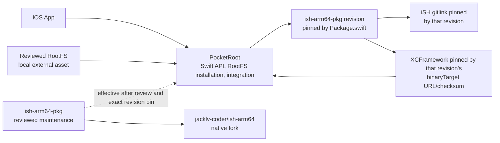
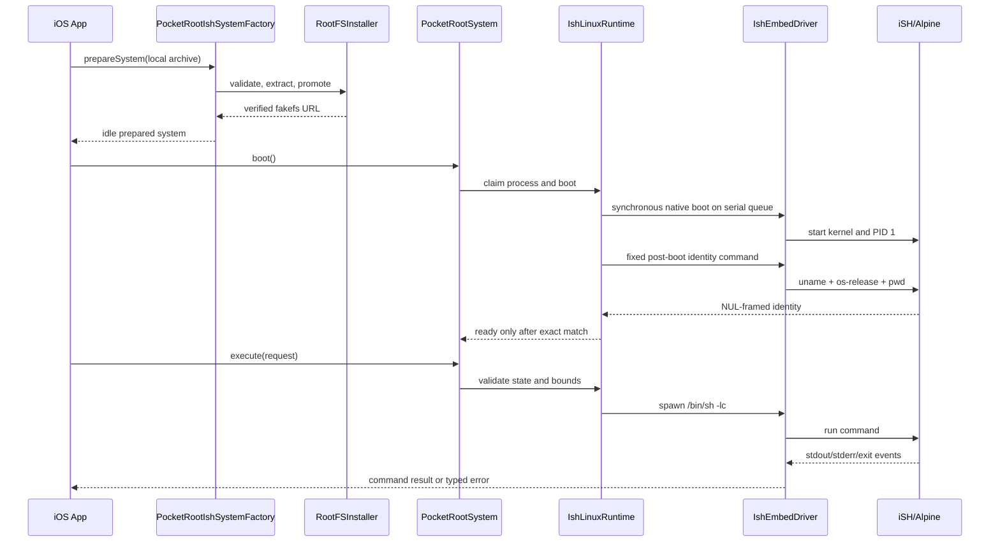

# PocketRoot Technical Learning Guide

[简体中文](../TechnicalGuide.md) | [English](TechnicalGuide.md) | [Documentation hub](README.md)

This guide is the starting point for future maintainers. It does not replace the focused documents. It first builds a complete mental model, then connects the product goal, three repositories, Swift modules, RootFS, native runtime, concurrency, tests, and release flow.

After reading it, you should be able to answer:

1. What problem does PocketRoot solve, and what is deliberately out of scope?
2. Why do the current consumer chain and next-version development chain involve `PocketRoot`, `ish-arm64-pkg`, and `ish-arm64`?
3. Which code handles `prepare → boot → execute → shutdown`?
4. When a layer changes, which repository, tests, and documents must change with it?

Use the [Roadmap](Roadmap.md) for dynamic completion status and [Upstream Dependencies](UpstreamDependencies.md) for exact revisions, gitlinks, artifact sizes, and hashes.

## 1. PocketRoot in one sentence

PocketRoot is a modular Swift project targeting iOS 18 and later. It installs
a hash-pinned ARM64 Linux fakefs inside the iOS sandbox, uses an experimental
native iSH runtime for bounded one-shot commands and persistent PTY sessions,
and provides SwiftTerm terminal and guest-file pages.

It is not:

- a complete fork of the iSH application;
- a general VM based on Apple Hypervisor;
- a multi-kernel or multi-tenant Linux service;
- a tool that downloads and executes arbitrary RootFS images;
- a way to bypass the iOS sandbox, signing, licensing, or App Store rules.

The real iSH path remains experimental. The default `PocketRoot` product neither links iSH nor bundles or downloads a RootFS.

In this guide, command bounds include one deadline from driver entry through
finite SPAWN, stdin close, and event reads; Swift stdout/stderr budgets; a
4 MiB/4096-frame native backlog per session; and a 4 MiB/256-frame total
control budget. Recovery after request
timeout or product-budget overflow still requires an observed `EXITED`;
otherwise the runtime fails closed. Termination and authoritative `EXITED`
confirmation after deadline expiry use a separate fixed bounded cleanup
window, so timeout is not a promise to return at that exact instant. An 8 MiB byte-exact binary-stdout smoke crosses the native backlog
and proves continuous consumption. After shutdown, the complete Simulator smoke
reads `ru_maxrss` and requires a lifecycle peak at or below 256 MiB. Physical
sustained-load and jetsam behavior remain open.

## 2. Three repositories and one external asset



The textual relationship is:

| Layer | Repository or asset | Owns | Does not own |
| --- | --- | --- | --- |
| Product and integration | [`jacklv-coder/PocketRoot`](https://github.com/jacklv-coder/PocketRoot) | Public Swift API, RootFS installation, iSH adapter, Demo, integration tests, and product docs | Building the native iSH binary |
| Packaging source | [`jacklv-coder/ish-arm64-pkg`](https://github.com/jacklv-coder/ish-arm64-pkg) `37231ab` | Swift wrapper, C ABI source, and binary-target declaration | The current declaration pins the published ABI.7 artifact |
| Current native artifact | The `v0.4.0-abi.7` URL/checksum | XCFramework final-linked by PocketRoot | Self-hosted fork prerelease; no RootFS |
| Current native runtime | The exact iSH gitlink recorded by that package revision | The iSH kernel and low-level process, signal, halt, and thread lifecycle | It cannot be replaced by another branch or local checkout |
| Current release commit | [`jacklv-coder/ish-arm64-pkg`](https://github.com/jacklv-coder/ish-arm64-pkg) `37231ab` | Pins the ABI.7 URL/checksum and contains atomic no-replace rename plus the existing deadline fixes | Identical to the tag, Release target, and PocketRoot package pin |
| Guest filesystem | License-reviewed `fs.tar.gz` | Alpine userspace, fakefs data, and guest tools | Storage in the PocketRoot Git repository |

### Why `ish-arm64-pkg` must sometimes change

Although `ish-arm64-pkg` originated elsewhere, PocketRoot compiles the Swift
wrapper at an exact revision and links the XCFramework selected by its
URL/checksum. The current pin uses the fork's `v0.4.0-abi.7`; a separate
corresponding-source asset records nested iSH, musl, and build inputs. RootFS
remains the separately pinned parent v0.3.3 asset.

Native work therefore moves in dependency order:

```text
fix low-level behavior in ish-arm64
  → update the gitlink, ABI, wrapper, tests, and artifacts in ish-arm64-pkg
  → publish a verifiable XCFramework and update the package binaryTarget URL/checksum
  → update PocketRoot's pinned package revision, adapter, and dependency evidence
  → run final-link and iOS smoke verification
```

Changes are made only in the user-owned forks, never pushed directly to third-party upstream repositories. Keeping the repositories separate makes source fixes, binary publication, and product integration independently reviewable and reversible.

The complete logical path from PocketRoot into the Linux guest is:

```text
PocketRootIshSystemFactory
→ PocketRootSystem / IshLinuxRuntime / IshEmbedDriver
→ IshInstance / IshSession in ish-arm64-pkg
→ ish_embed_boot / ish_embed_spawn in the C ABI
→ host control writer / event reader
→ framed protocol
→ guest PID 1 supervisor
→ fork/exec, pipe, or PTY
→ EXITED / ERROR
→ Swift result
```

PocketRoot owns the first half and the product boundary. For the second half,
read the corresponding source and gitlink from the package revision currently
pinned by PocketRoot. Wrapper revision `37231ab` is the ABI.7 release commit:
it contains the absolute deadline across Swift option marshalling and native
admission, native stdin-close reuse of the original SPAWN deadline, atomic
no-replace guest rename, and the binary target selecting the independently
verified ABI.7 asset. Native behavior
remains evidenced by that Release's corresponding source, hashes, and runtime
validation. ABI.6 unblocks internal SIGUSR1 on the
embedded bootstrap and guest task threads so guest signals can interrupt
blocking host syscalls. It also contains ABI.3's bounded fixed-size uname
copies and the ABI.2 `/proc` lifecycle-lock fix.

## 3. PocketRoot repository map

| Path | Purpose | What to learn |
| --- | --- | --- |
| `Package.swift` | SwiftPM products, targets, and pinned dependencies | Which products are safe by default and which explicitly enable iSH |
| `Sources/PocketRootCore/` | Public models, actors, and runtime protocol | How the API is decoupled from a concrete iSH implementation |
| `Sources/PocketRootAgent/` | Bounded model/tool loop | Why agent orchestration stays above Core without installing Codex CLI |
| `Sources/PocketRootResources/` | RootFS manifest, validation, extraction, and installation | How external assets fail closed |
| `Sources/CPocketRootArchiveSupport/` | Narrow zlib streaming C interface | The Swift/C boundary and expanded-size ceiling |
| `Sources/PocketRootIshRuntime/` | iSH adapter, driver, serial execution, and ownership | How blocking native APIs enter Swift Concurrency |
| `Sources/PocketRootIshRuntimeIntegration/` | Factory that combines RootFS and runtime | The application-facing `prepareSystem` entry point |
| `Sources/PocketRootTerminal/` | SwiftTerm PTY, guest files, and fallback facade | How UI connects registered sessions within fixed bounds |
| `Demo/PocketRootDemo/` | Safe-default UIKit demo | Separation between UI and experimental runtime |
| `Spikes/` | Final-link and native smoke applications | The difference between compiling and running the real runtime |
| `Tests/` | Swift unit and integration tests | State, bounds, recovery, and error semantics |
| `Scripts/` | Bootstrap, build, docs, and smoke entry points | Shared local and CI commands |
| `Docs/` | Chinese primary docs and `en/` mirrors | Design facts, gates, and maintenance rules |

## 4. Swift module layers

### 4.1 Safe-default layer

- `PocketRootCore` defines `PocketRootSystem`, commands, results, states, errors, and the runtime protocol.
- `PocketRootResources` handles only a caller-provided local RootFS and does not start a runtime.
- `PocketRootTerminal` provides a SwiftTerm-backed PTY, guest file pages, and
  an optional cwd-carrying one-shot fallback.
- `PocketRoot` re-exports those three safe modules.

`PocketRootSystem.shared` uses `PlaceholderLinuxRuntime`. An application depending only on `PocketRoot` therefore does not link the experimental native binary merely by importing the module.

### 4.2 Explicit agent layer

- `PocketRootAgent` is a provider-agnostic, resource-bounded model/tool loop
  with an optional OpenAI Responses transport.
- `PocketRootAgentRuntimeTools` composes the Core command seam behind host
  policy and per-call approval.
- Neither product is in the safe umbrella; neither stores credentials or
  installs Codex CLI.

Applications select `PocketRootAgent` explicitly and add
`PocketRootAgentRuntimeTools` only for the command adapter; see
[Lightweight Agent Loop](Agent.md).

### 4.3 Experimental runtime layer

- `PocketRootIshRuntime` maps Core's `LinuxRuntime` protocol to IshEmbed.
- `PocketRootIshRuntimeIntegration` installs the RootFS and creates a `PocketRootSystem` bound to that installation.

An application that needs real Linux explicitly depends on `PocketRootIshRuntimeIntegration`, retains the system returned by the factory, and injects it into application services. The factory does not replace the global `PocketRootSystem.shared`.

See [Architecture](Architecture.md) for the full product dependency graph.

## 5. End-to-end command path



### 5.1 `prepareSystem`

Entry point: `PocketRootIshSystemFactory.prepareSystem`.

It performs three tasks:

1. validates the local archive against the caller-supplied manifest, defaulting to the committed `.ishEmbedV0_3_3` when omitted;
2. safely installs or reuses a fakefs;
3. creates a system bound to that fakefs, still in `idle` state.

It neither downloads the RootFS nor boots automatically.

Validation proves only that the bytes match the supplied manifest. A custom manifest must itself be pinned and independently reviewed. Neither a manifest nor SHA-256 makes an asset inherently safe, grants distribution authorization, or satisfies license obligations. The caller still owns local acquisition, provenance review, and the decision to use or distribute it.

### 5.2 `boot`

`PocketRootSystem` delegates to `RuntimeCoordinator`, then to `IshLinuxRuntime`. The runtime first validates the fakefs layout synchronously. After validation, it enters `.booting` before its first suspension, claims process-global ownership, and sends the synchronous native call to a dedicated serial queue. A layout failure occurs before the state transition.

`ready` means native boot returned and the built-in identity gate matched the configured architecture, Alpine identity, optional version, and guest working directory. The built-in v0.3.3 RootFS manifest pins `aarch64`, `alpine`, `3.19.1`, and the configured cwd. This does not prove every application tool, network, or data dependency is healthy; applications may add domain checks after ready.

### 5.3 `execute`

A one-shot command currently becomes:

```text
/bin/sh -lc <request.command>
```

`command` is therefore a shell string, and caller code owns quoting and injection boundaries. The runtime also verifies that:

- the system is ready;
- timeout is positive and no longer than 24 hours;
- stdout and stderr limits are valid;
- no second one-shot command is in flight;
- this system still owns the global iSH instance.

The driver creates one absolute deadline at entry, passes its remaining time
to finite `spawn`, closes stdin, and then reads events incrementally. ABI.6
covers the native instance/spawn gates and control-queue admission from SPAWN
API entry, and uses bounded asynchronous admission for stdin close and
terminate. SPAWN deadline expiry without a session becomes a normal timed-out
result. Direct not-running, protocol, or broken-pipe spawn failures fail the
runtime closed.
After spawn, close-stdin failures, non-timeout read failures, deadline expiry,
and product-output overflow request termination and confirm exit. Wire v4
returns supervisor rejection, broken pipe, and native-backlog overflow as typed
errors. Guest exit 17 is therefore valid; a negative `EXITED` payload is a
protocol-integrity failure. Native-backlog overflow requests bounded session
cleanup and preserves the byte/frame provenance. Because upstream
`session.close()` is void, Swift cannot tell whether cleanup escalated to
instance fail-close, so PocketRoot conservatively closes its process gate and
requires a restart. The same request deadline covers driver entry, SPAWN,
stdin close, and the read loop; termination/`EXITED` confirmation after expiry
uses a separate fixed bounded cleanup window.

Swift Task cancellation crosses the serial native queue through a thread-safe
token. A command cancelled while queued never enters the driver. Once spawned,
the driver terminates the session and throws `CancellationError` only after a
trusted `EXITED` event. If cleanup cannot be confirmed, that cleanup error
replaces cancellation and the runtime fails closed. Successful cancellation
keeps the runtime ready for another command. It stops the process but cannot
undo filesystem, network, or other guest side effects that already happened.

Atomic no-replace rename shares serial native admission with one-shot
commands. An existing destination or guest errno is a recoverable filesystem
result. A native rename timeout, however, means the mutation may have been
admitted without a confirmable outcome, so PocketRoot fails the runtime closed
and requires a host restart before further use.

### 5.4 `shutdown`

Shutdown semantics depend on the native artifact currently pinned by PocketRoot. While learning or debugging, inspect `Package.swift` and [Upstream Dependencies](UpstreamDependencies.md) first. Do not treat fork code that is not yet released and integrated as current product behavior.

Pinned `v0.4.0-abi.7` stops the supervisor, soft-halts the embedded kernel,
performs a bounded join, and returns to Swift. Public state becomes
`.terminated`; process-global iSH state still permits only one valid
boot/shutdown lifecycle, so the same host process cannot boot again.

## 6. Concurrency and lifecycle model

PocketRoot combines Swift actors with synchronous C APIs. The key question is not simply how many threads exist, but who owns state and who may block.

| Mechanism | Problem solved |
| --- | --- |
| `PocketRootSystem` actor | Isolates the application-visible system reference and public state |
| `IshLinuxRuntime` actor | Protects runtime state, in-flight command state, and owner ID |
| `IshProcessGate` actor | Allows only one iSH owner in a host process |
| `BlockingIshExecutor` | Keeps synchronous native calls off the main and Swift cooperative executors |
| `commandInFlight` | Prevents concurrent one-shot commands in the current phase |
| `IshCommandCancellation` | Bridges Swift Task cancellation into the synchronous driver and completes only after guest exit is confirmed |
| Timeout and output limits | One deadline covers finite SPAWN, stdin close, and the read loop from driver entry; termination and `EXITED` confirmation after expiry use a separate fixed bounded cleanup window, while Swift budgets and native backlog/control budgets jointly bound output and control backlog |

Typical state direction:

```text
idle → booting → ready → shuttingDown → terminated
          └──────────────→ failed
```

Two details matter:

1. Actors may re-enter at `await`, so lifecycle state must change before the first suspension.
2. `PocketRootSystem.state` is a public snapshot after an operation completes, not a live stream of native boot or shutdown progress.

PocketRoot now exposes IshEmbed PTYs through `PocketRootSystem.makeSession` and
registers every live session, while still allowing only one in-flight one-shot
command. Sessions share one iSH kernel and fakefs. A VM remains a chroot tree
inside that kernel, not another kernel or a hardened boundary for untrusted
code; interactive sessions currently do not set `chrootPath`.

## 7. RootFS is not an ordinary extracted directory

iSH represents Linux files with fakefs. The related names are not interchangeable:

| Name | Meaning |
| --- | --- |
| Alpine minirootfs | Upstream guest-build input, not a format accepted directly by the PocketRoot installer |
| Materialized fakefs | `meta.db + data/` generated by tools such as `fakefsify` |
| PocketRoot RootFS archive | A gzip/ustar with top-level `fs/`, exactly matching the caller-supplied manifest; the default manifest comes from the repository |
| Installed RootFS | Version directory after installer promotion, with `meta.db + data/` directly at its top level |
| Guest supervisor | AArch64 PID 1 program handling spawn, pipes/PTYs, and process reaping inside Linux |
| Corresponding source | Source archive corresponding to GPL binaries; it is not the RootFS asset and does not contain it |

PocketRoot currently requires the installed materialized root to contain at least:

```text
rootfs/<version>/
├── meta.db
├── data/
└── .pocketroot-rootfs.json
```

Core installation invariants are:

1. input is a local, regular, non-symlink file;
2. it is copied into a private same-volume staging snapshot before validation and extraction;
3. compressed size, SHA-256, expanded size, entry count, and tar types are bounded;
4. absolute paths, `..`, symlinks, hardlinks, and device nodes are rejected;
5. promotion occurs only after candidate-layout validation;
6. a replacement journal lets the next run commit or roll back after interruption;
7. failure cannot destroy the last verified installation.

The RootFS binary remains behind provenance and licensing gates. It is not committed to the repository, and PocketRoot does not download it. See [RootFS Security](RootFS.md) for the algorithm and threat boundary.

The native package version and RootFS version are independent axes. The former selects the Swift wrapper, C ABI, protocol, and XCFramework; the latter selects Alpine guest contents and its manifest. Publishing a new XCFramework does not publish a new RootFS, and the two may use different version numbers after compatibility verification.

## 8. Mapping public behavior to source

| Behavior to trace | Start here | Next layer |
| --- | --- | --- |
| `boot/execute/shutdown` | `PocketRootSystem.swift` | `RuntimeCoordinator.swift` → `IshLinuxRuntime.swift` |
| Why the default system fails safely | `PlaceholderLinuxRuntime.swift` | Product dependencies in `Package.swift` |
| RootFS manifest | `RootFSArtifactManifest.swift` | `RootFSValidator.swift` |
| Extraction rules | `RootFSGzipTarExtractor.swift` | `CPocketRootArchiveSupport.c` |
| Installation reuse and recovery | `RootFSInstaller.swift` | `Tests/PocketRootResourcesTests/` |
| Swift-to-native bridge | `IshEmbedDriver.swift` | `Sources/IshEmbed/` and the C ABI in ish-arm64-pkg |
| Native kernel behavior | The `third_party/ish` gitlink in ish-arm64-pkg | The corresponding ish-arm64 commit |
| Demo screens | `Demo/PocketRootDemo/` | `project.yml` |
| Native behavior evidence | `Spikes/PocketRootIshRuntimeSmoke/` | `Scripts/run-runtime-smoke.sh`, `Scripts/run-runtime-device-smoke.sh` |

See [Implementation](Implementation.md) for method-by-method details.

## 9. Match verification to the change

| Change | Primary repository | Minimum verification |
| --- | --- | --- |
| UI, public models, placeholder | PocketRoot | `./Scripts/test.sh`, `./Scripts/build.sh` |
| SwiftPM products or iOS baseline | PocketRoot | Package tests, Demo build, runtime final link |
| RootFS extraction, install, recovery | PocketRoot | Resources tests, real-asset test, docs check |
| iSH Swift adapter | PocketRoot | Runtime tests, compile spike, native smoke |
| C ABI, session I/O, supervisor | ish-arm64-pkg | C tests, sanitizers, Swift tests, XCFramework verification |
| Kernel halt, thread, or process behavior | ish-arm64 and ish-arm64-pkg | Native regression, rebuilt artifacts, Simulator and device lifecycle |
| Dependency revision/checksum | ish-arm64-pkg and PocketRoot | Source/asset verification, both consumer modes, final link, and smoke |
| Documentation or behavior contract | Owning repository | Language mirror, link checks, and command execution |

Release order cannot be reversed: PocketRoot must not reference an XCFramework that is not yet public and independently verifiable. Native changes pass CR, CI, and release gates in the package repository first; PocketRoot then pins the immutable input.

## 10. Local verification layers

Run from fastest to slowest:

```bash
./Scripts/bootstrap.sh
./Scripts/test.sh
./Scripts/check-docs.sh
./Scripts/build.sh
./Scripts/build-runtime-spike.sh
```

A clean clone should run `bootstrap.sh` first because `build.sh` requires an Xcode project generated from `project.yml` but not committed to Git. `build-runtime-spike.sh` regenerates the project itself, but still requires XcodeGen and the dependency environment. After bootstrap, and when project configuration has not changed, later checks can start below it.

When a reviewed RootFS exactly matches the manifest, also run:

```bash
POCKETROOT_ROOTFS_ARCHIVE=/absolute/path/to/fs.tar.gz \
  swift test --filter testPinnedReleaseArchiveWhenProvidedByEnvironment

POCKETROOT_ROOTFS_ARCHIVE=/absolute/path/to/fs.tar.gz \
  ./Scripts/run-runtime-smoke.sh
```

These layers answer different questions:

- Is unit behavior correct?
- Are bilingual docs paired and links valid?
- Does the safe-default Demo build?
- Does the experimental graph produce final iOS executables?
- Can the pinned real asset be installed safely?
- Can the real iSH guest complete its lifecycle in an iOS Simulator?

See [Testing](Testing.md) for environment and coverage details.

## 11. Recommended learning path

### Step one: establish the product boundary

Read in order:

1. [Product Plan](ProductPlan.md)
2. [Roadmap](Roadmap.md)
3. [Release and Compliance](ReleaseCompliance.md)

The goal is to understand why experimental success is not production readiness.

### Step two: follow only the safe-default path

1. Follow [Getting Started](GettingStarted.md) to check Xcode, Swift, Homebrew, and XcodeGen, then run `./Scripts/bootstrap.sh` and `./Scripts/test.sh`. `bootstrap.sh` may install XcodeGen through Homebrew when it is missing.
2. Trace `PocketRootSystem.shared` to `PlaceholderLinuxRuntime`.
3. Read `Package.swift` and confirm that the default product has no iSH dependency.
4. Note that the repository Demo is an explicit Experimental integration
   target, not part of the safe-default product path.

### Step three: learn RootFS handling

1. Read the manifest, validator, extractor, and installer.
2. Find corrupt-archive, path-escape, reuse, and interruption-recovery tests in Resources tests.
3. Use synthetic fixtures to understand the algorithm without a real RootFS.
4. Only then study the real-asset gates.

### Step four: trace one command

Start at `PocketRootIshSystemFactory`, then follow `PocketRootSystem`, `IshLinuxRuntime`, and `IshEmbedDriver`. Pay special attention to state changes before each `await`, serial native execution, and session cleanup.

### Step five: understand the native supply chain

1. Read the package revision pinned in PocketRoot's `Package.swift`.
2. Read the `third_party/ish` gitlink in ish-arm64-pkg.
3. Match it to the ish-arm64 commit.
4. Inspect XCFramework checksum, slices, minimum OS, and licenses.
5. Understand why source commits and release assets need a one-to-one correspondence.

### Step six: make a low-risk exercise change

Prefer a Swift unit test, an error explanation, or a Demo presentation improvement. Run the relevant tests and docs check, then inspect the Git diff. Do not use shutdown, signals, filesystem promotion, or release scripts as a first exercise.

## 12. Deciding whether documentation is still current

When sources disagree, use this order:

1. code in the current checkout, `Package.swift`, `Package.resolved`, and gitlinks;
2. artifact checksums, architectures, and load commands;
3. fixed facts in [Upstream Dependencies](UpstreamDependencies.md);
4. dynamic status in the [Roadmap](Roadmap.md);
5. learning summaries in this guide and the READMEs.

Do not substitute an unmerged PR, another local worktree, or a planned release for current repository facts. A behavior, API, dependency, hash, or gate change must update the Chinese primary document and English mirror in the same PR.

## 13. Glossary

| Term | Meaning |
| --- | --- |
| host | The iOS App process containing PocketRoot |
| guest | Alpine Linux userspace running inside iSH |
| fakefs | iSH's `meta.db + data/` filesystem representation |
| RootFS archive | Caller-provided fakefs archive verified against a pinned hash |
| wrapper | ish-arm64-pkg code mapping the C ABI to Swift |
| XCFramework | Prebuilt iOS device/simulator artifact consumed by SwiftPM |
| gitlink | Exact submodule commit recorded by a parent repository |
| one-shot command | A command that starts a process, collects output up to configured Swift result budgets, and is awaited to exit |
| process gate | Gate preventing multiple systems from owning the process-global iSH singleton |
| final link | Producing a complete App executable rather than only compiling a library |
| smoke | End-to-end verification using real artifacts and RootFS |

## 14. Further reading

- [Architecture](Architecture.md): source of truth for modules, dependencies, concurrency, and lifecycle.
- [Implementation](Implementation.md): method-level source and call-path explanation.
- [Integration Guide](IntegrationGuide.md): practical use of the public API.
- [RootFS Security](RootFS.md): installation algorithm and threat boundary.
- [Testing](Testing.md): what each verification layer proves.
- [Troubleshooting](Troubleshooting.md): mapping symptoms to modules.
- [Upstream Dependencies](UpstreamDependencies.md): immutable identities for repositories and binaries.
- [ADR-001](Decisions/ADR-001-IshEmbed-Feasibility.md): reasons and consequences of experimental IshEmbed adoption.
