# PocketRoot

[简体中文](README.md) | [English](README.en.md)

PocketRoot provides embeddable ARM64 Linux runtime, terminal, and upper-layer
lightweight-agent foundations for iOS. Its Swift Package modules can securely
install a verified Alpine fakefs and, through the Experimental iSH/IshEmbed
adapter, execute bounded one-shot shell commands inside the iOS sandbox.

> [!WARNING]
> Native iSH integration is **Experimental**. Pinned `v0.4.0-abi.6` has a soft shutdown that returns to Swift, but each host process still permits only one valid boot/shutdown lifecycle. iPad, sustained-load, and distribution gates remain open. This version is not approved for production, TestFlight, or public binary distribution.

## Capability status

| Capability | Status | Notes |
| --- | --- | --- |
| Swift Package modules and public API | Available | Core, Resources, Terminal, Agent, Agent Runtime Tools, and safe umbrella |
| UIKit Demo shell | Available | System, Terminal, Commands, and Diagnostics entry points |
| RootFS verification and safe install | Available | Fixed digest, secure extraction, journal-protected same-volume promotion, reuse, recovery |
| iSH boot and one-shot commands | Experimental | `iOS + arm64`; one-shot cancellation confirms guest exit |
| Lightweight agent loop | Core, OpenAI transport, and approval-gated command tool available | Agent and Runtime Tools are explicit opt-ins; no Codex CLI install or automatic shell approval |
| Interactive PTY and SwiftTerm | Not implemented | Session input, resize, signal, and safe close remain planned |
| Physical devices and distribution | Partially passed / blocked | Multiple iPhone runtime gates and the unsigned engineering App file/Mach-O/entitlement scan passed; real storage pressure, iPad, jetsam/power-cut, final signed/exported-artifact scanning and its complete SBOM, license/NOTICE/corresponding-source, and App Store gates remain |

The default `PocketRoot` product includes neither the agent loop nor native
iSH and never bundles or downloads a RootFS. Agent applications explicitly
select `PocketRootAgent`. Select `PocketRootAgentRuntimeTools` only for the
approval-gated command adapter; real runtime applications explicitly select
`PocketRootIshRuntimeIntegration`. `PocketRootSystem.shared` remains a safe
placeholder.

## Implementation overview

```mermaid
flowchart LR
    A["Caller-owned reviewed local RootFS archive"] --> B["PocketRootResources verifies and installs"]
    B --> C["Versioned fakefs directory"]
    C --> D["PocketRootIshRuntimeIntegration composes a system"]
    D --> E["PocketRootIshRuntime boots IshEmbed"]
    E --> F["Validate aarch64, Alpine identity, and cwd"]
    F --> G["/bin/sh -lc executes a bounded command"]
    G --> H["exit, signal, stdout, stderr, timeout"]
```



Design principles:

- The RootFS payload is not committed; the library performs no network download.
- Source, XCFramework, and RootFS inputs are pinned by immutable revision or digest.
- Extraction occurs in private same-volume staging. After validation, the installer persists the candidate tree, then performs recoverable promotion through a durable journal, synchronized rename parents, and atomic durable `current.json`. The sequence is still not one atomic operation, but explicit file/directory ordering plus power-loss cut-point recovery can infer commit or rollback; physical-device forced-power-cut evidence remains a separate gate.
- IshEmbed is process-global: one native owner and one in-flight command.
- Synchronous native work runs on a serial blocking executor away from the main and Swift cooperative executors.
- Cancelling a one-shot command terminates its native session and returns only
  after guest `EXITED`; success keeps the runtime reusable, while unconfirmed
  cleanup fails closed. It does not roll back earlier side effects.
- `boot()` reports `ready` only after a fixed post-boot command verifies guest architecture, Alpine identity, and command context. The built-in v0.3.3 RootFS manifest also requires Alpine `3.19.1` exactly.
- One absolute request deadline starts at driver entry and covers finite native
  SPAWN, stdin-close admission, and the event-read loop; authoritative `EXITED`
  confirmation after termination has a separate fixed bounded cleanup window.
  Swift stdout/stderr budgets remain independent. The native transport adds a
  4 MiB/4096-frame output backlog per session, a 4 MiB/256-frame total control
  budget, and lifecycle reserve. An 8 MiB binary-stdout smoke crosses the native
  backlog and verifies every byte; the complete Simulator smoke lifecycle also
  requires process `ru_maxrss` at or below 256 MiB. That gate is not
  physical-device jetsam evidence. Supervisor and transport failures are typed;
  normal guest exit 17 remains valid, and unconfirmed cleanup still fails closed.

See [Architecture](Docs/en/Architecture.md), [Implementation](Docs/en/Implementation.md), and [RootFS Security](Docs/en/RootFS.md).

## Requirements

- macOS on Apple Silicon for native work
- Xcode 16.0+ with iOS 18 SDK
- Swift 5.10+
- iOS 18.0+
- Homebrew and XcodeGen

macOS 13 is a host-test declaration, not a supported guest platform. IshEmbed has arm64 iOS device and arm64 Simulator slices only. An App target that selects the Experimental products must exclude x86_64 Simulator before SwiftPM product resolution; `isAvailable` is a post-link runtime probe, not a remedy for a missing binary slice. Native behavior has been validated with Xcode 16.0 / iOS 18.0 SDK and Xcode 26.1.1 / iOS 18.2 arm64 Simulator; both environments completed final links and the 17-check native smoke.

## Build from source

```bash
git clone git@github.com:jacklv-coder/PocketRoot.git
cd PocketRoot

./Scripts/bootstrap.sh
./Scripts/test.sh
./Scripts/build.sh
open PocketRootDemo.xcodeproj
```

`bootstrap.sh` resolves packages and generates the project with XcodeGen. The generated project is ignored; `project.yml` is authoritative.

The current Demo is a UI/public-API shell, not an Alpine-running app. System and Commands use the placeholder shared system, Terminal has no PTY, and Diagnostics exposes future seams. Native validation uses dedicated compile and smoke targets.

See [Getting Started](Docs/en/GettingStarted.md).

## Experimental application use

Select `PocketRootIshRuntimeIntegration` explicitly. No stable Git tag exists yet, so remote consumers must pin a reviewed full commit rather than a moving branch.

```swift
import Foundation
import PocketRoot
import PocketRootIshRuntime
import PocketRootIshRuntimeIntegration

guard PocketRootIshRuntimeFactory.isAvailable else {
    fatalError("The native runtime requires an arm64 iOS build.")
}

let applicationSupportURL = try FileManager.default.url(
    for: .applicationSupportDirectory,
    in: .userDomainMask,
    appropriateFor: nil,
    create: true
)

let prepared = try await PocketRootIshSystemFactory.prepareSystem(
    archiveURL: localReviewedArchiveURL,
    applicationSupportURL: applicationSupportURL
)

try await prepared.system.boot()

let result = try await prepared.system.execute(
    PocketRootCommandRequest(
        command: "/bin/uname -m",
        workingDirectory: "/",
        timeout: .seconds(30)
    )
)

print(result.exitCode)
print(result.stdout)
print(result.stderr)
```

Contract:

1. `archiveURL` is a caller-owned reviewed local regular file.
2. Preparation verifies, installs, and composes; it does not download or boot.
3. `applicationSupportURL/rootfs/<version>` directly contains `meta.db`, `data/`, and `.pocketroot-rootfs.json`; there is no retained `fs/` layer. A valid version directory and installation record can be reused even when `current.json` is missing or mismatched; reuse repairs it.
4. Boot is explicit and runs the default health gate on the same serial native executor. The built-in v0.3.3 RootFS manifest returns `ready` only after observing `aarch64`, Alpine `3.19.1`, and the configured guest working directory.
5. Commands run through `/bin/sh -lc` and are shell strings, not argv-safe APIs.
6. Each request owns cwd, environment, timeout, and stderr policy.
7. Native shutdown soft-halts and joins the kernel before returning. It publishes `.terminated`, and the same host process cannot boot again.
8. Completed public calls publish only stable states. Fail-close exposes `.failed`; reentrant calls cannot leak internal transitions, and older asynchronous snapshots cannot overwrite a newer failure.

See the [Integration Guide](Docs/en/IntegrationGuide.md).

## RootFS policy

The repository records metadata and secure install code, not `fs.tar.gz`:

- RootFS manifest corresponding to parent IshEmbed package release `v0.3.3`
- Alpine `3.19.1 aarch64`
- archive size `6,581,376` bytes
- expanded tar size `18,838,016` bytes
- SHA-256 `be0f3c133f78f28b023288459b33dc28fa253a6ef29f7123bc5f3892edf90ad4`

The pinned URL is metadata, not an automatic download. The repository now
generates a RootFS package inventory and SPDX SBOM, has engineering-reviewed
candidate source material for all ten origins, and records checksum-bound
review of all 78 initial and 138 external LICENSE/NOTICE payloads. The
historical builder source is identified, but the pinned release archive's
exact environment and rebuild remain unverified. A schema-v4 successor is
byte-reproducible across two same-host invocations and four total builds, and
a five-unit source-delivery inventory plus a unified external candidate
materializer is recorded, but neither replaces the pin. The repository also
generates a reproducible maximal Experimental composition inventory/SPDX SBOM
and CI ephemerally scans the unsigned device runtime App's complete file tree,
Mach-O, signature/entitlements, and risk signals into a file-level SPDX 2.3
SBOM. A local runner also builds and scans a development-signed engineering
`.xcarchive` with equivalent deterministic evidence. Neither path uploads scan
output or represents a final release-signed/exported App archive. Do not add
the payload to a Package/App bundle before the
complete NOTICE/source offer, legal and delivery approval, and complete
release-artifact SBOM review.

## Validation

```bash
./Scripts/check-docs.sh
./Scripts/test.sh
./Scripts/build.sh
./Scripts/build-runtime-spike.sh

POCKETROOT_ROOTFS_ARCHIVE=/path/to/fs.tar.gz \
  swift test --filter testPinnedReleaseArchiveWhenProvidedByEnvironment

POCKETROOT_ROOTFS_ARCHIVE=/path/to/fs.tar.gz \
  ./Scripts/run-runtime-smoke.sh

POCKETROOT_DEVELOPMENT_TEAM=<team-id> \
POCKETROOT_SIGNED_ARCHIVE_OUTPUT=/absolute/new/archive-scan \
POCKETROOT_SPDX_SCHEMA=/absolute/spdx-2.3-schema.json \
  ./Scripts/build-signed-engineering-archive.sh

POCKETROOT_ROOTFS_ARCHIVE=/path/to/fs.tar.gz \
POCKETROOT_SMOKE_DEVICE=<physical-device-reference> \
POCKETROOT_DEVELOPMENT_TEAM=<team-id> \
  ./Scripts/run-runtime-device-smoke.sh
```

The signed-archive runner only builds and scans a development-signed
`.xcarchive` on the Mac; it never installs, exports, or uploads it. Both native
smoke runners require Apple Silicon and the exact local RootFS archive. The
first uses an iOS 18 Simulator; the second requires a paired iOS 18+ physical
device with Developer Mode and development signing. Its reference may be any
CoreDevice UUID, hardware UDID, or device name accepted by `devicectl`; the
runner validates a physical iOS device and resolves its hardware UDID first.
They cover preparation, guest identity, command context, streams, exit,
timeout/output-limit recovery, and soft shutdown that returns to Swift. See
[Testing](Docs/en/Testing.md).

## Documentation

| Topic | Document |
| --- | --- |
| System-wide mental model and learning path | [Technical Learning Guide](Docs/en/TechnicalGuide.md) |
| Users, use cases, MVP, and non-goals | [Product Plan](Docs/en/ProductPlan.md) |
| Checkout, build, and Demo | [Getting Started](Docs/en/GettingStarted.md) |
| Product selection and API use | [Integration Guide](Docs/en/IntegrationGuide.md) |
| Lightweight agent loop, boundaries, and transport plan | [Lightweight Agent Loop](Docs/en/Agent.md) |
| Modules, concurrency, lifecycle | [Architecture](Docs/en/Architecture.md) |
| Source-level flows | [Implementation](Docs/en/Implementation.md) |
| RootFS threat model and recovery | [RootFS Security](Docs/en/RootFS.md) |
| Test layers and native smoke | [Testing](Docs/en/Testing.md) |
| Common failures | [Troubleshooting](Docs/en/Troubleshooting.md) |
| Dynamic gates and next work | [Roadmap](Docs/en/Roadmap.md) |
| Revisions, gitlinks, and hashes | [Upstream Dependencies](Docs/en/UpstreamDependencies.md) |
| License and distribution | [Release and Compliance](Docs/en/ReleaseCompliance.md) |
| IshEmbed decision | [ADR-001](Docs/en/Decisions/ADR-001-IshEmbed-Feasibility.md) |
| Development workflow | [Contributing](CONTRIBUTING.en.md) |
| Changes | [Changelog](CHANGELOG.en.md) |

See the [Documentation Hub](Docs/en/README.md).

## License and release

PocketRoot's first-public-release license policy is still being finalized. The Experimental runtime links GPL-identified upstream code and the candidate RootFS contains multiple copyleft and permissive licenses. Package-level, maximal Experimental engineering-composition, and unsigned engineering-App file-level SPDX SBOMs are generated, but production, TestFlight, and public distribution remain blocked until complete physical-device lifecycle, license, NOTICE, corresponding source, a complete SBOM from the scanned final signed/exported artifact, and App Store 2.5.2 gates have explicit dispositions.
