# PocketRoot

[简体中文](README.md) | [English](README.en.md)

**Embed a local Linux Terminal and Files workspace in any iOS app.**

[](https://github.com/jacklv-coder/PocketRoot/actions/workflows/ci.yml)


PocketRoot is a local Linux Workspace SDK for iPhone and iPad apps. Its Swift
Package combines an iSH-based ARM64 Linux runtime, an interactive SwiftTerm
terminal, guest file browsing, secure RootFS installation, and Swift lifecycle
APIs. Everything runs locally inside the App sandbox—no remote shell, no
jailbreak, and no Codex CLI installation.

## What you can embed

- **Terminal** — a full PTY session with input, streaming output, resize,
  signal, EOF, and ordered shutdown.
- **Files** — browse, create, rename, and delete guest items with bounded
  previews, import through the system document picker, and export through the
  system share sheet.
- **Workspace** — switch between Terminal and Files while keeping the same
  terminal session alive.
- **Linux Runtime** — prepare, boot, and manage an iSH-based Alpine ARM64
  environment inside the iOS sandbox.
- **RootFS lifecycle** — verify, install, reuse, and recover a caller-supplied,
  reviewed RootFS archive.
- **Swift APIs and ready-made UI** — execute bounded commands or present UIKit
  and SwiftUI workspace screens directly.

PocketRoot is not another terminal App and it is not a new operating system.
It is the SDK layer for embedding a local Linux Terminal + Files workspace in
an existing iOS App. Start with the
[complete Demo](Examples/PocketRootDemo), the
[two-entry Quick Start](Examples/PocketRootQuickStartApp), the
[lifecycle Host App](Examples/PocketRootHostApp), or the
[integration guide](Docs/en/IntegrationGuide.md).

> [!WARNING]
> Native iSH integration is **Experimental**. Pinned `v0.4.0-abi.9` has a soft shutdown that returns to Swift, atomic no-replace rename, and bounded stdin writes, but each host process still permits only one valid boot/shutdown lifecycle. Physical iPad, sustained-load, and distribution gates remain open. This version is not approved for production, TestFlight, or public binary distribution.

## Capability status

| Capability | Status | Notes |
| --- | --- | --- |
| Swift Package modules and public API | Available | Core, Resources, Terminal, Agent, Agent Runtime Tools, and safe umbrella |
| UIKit Demo shell | Available | System, Terminal, Files, Commands, and Diagnostics entry points |
| RootFS verification and safe install | Available | Fixed digest, secure extraction, journal-protected same-volume promotion, reuse, recovery |
| iSH boot and one-shot commands | Experimental | `iOS + arm64`; one-shot cancellation confirms guest exit |
| Terminal and file browser | Embeddable / Experimental | UIKit/SwiftUI inject a booted system; persistent SwiftTerm PTY plus inline tree expansion, navigation, bounded previews, safe mutations, and 1 MiB-capped document import/share export |
| Lightweight agent loop | Core, OpenAI transport, and approval-gated command tool available | Agent and Runtime Tools are explicit opt-ins; no Codex CLI install or automatic shell approval |
| Interactive PTY and SwiftTerm | Implemented; broader device validation pending | Public sessions, bounded reads, input, resize, signal/EOF, registry, and close-before-shutdown are connected; iPhone/iPad Simulators pass PTY, lifecycle, Files/Workspace, system document import/share-save round trips, and ordered shutdown |
| Physical devices and distribution | Partially passed / blocked | One-shot iPhone gates and unsigned engineering App scanning passed; the new PTY still needs device lifecycle coverage, plus storage pressure, physical iPad, jetsam/power-cut, final artifact, and compliance gates |

The default `PocketRoot` product includes neither the agent loop nor native
iSH and never bundles or downloads a RootFS. Agent applications explicitly
select `PocketRootAgent`. Select `PocketRootAgentRuntimeTools` only for the
approval-gated command adapter; real runtime applications explicitly select
`PocketRootIshRuntimeIntegration`. `PocketRootSystem.shared` remains a safe
placeholder.

## Smallest UI integration

Retain one `PocketRootIshWorkspaceHost` in the App or scene owner, then present
the Terminal or Files screen directly. On first presentation the screen
prepares the local RootFS and boots the runtime; the App does not need to poll
`readySystem` first:

```swift
import PocketRoot
import PocketRootIshRuntimeIntegration

let host = PocketRootIshWorkspaceHost(
    runtimeConfiguration: .init(
        archiveURL: localReviewedRootFSURL,
        applicationSupportURL: applicationSupportURL
    )
)

func openTerminal() {
    navigationController?.pushViewController(
        host.makeTerminalViewController(),
        animated: true
    )
}

func openFiles() {
    navigationController?.pushViewController(
        host.makeFilesViewController(),
        animated: true
    )
}
```

`localReviewedRootFSURL` must identify a local archive that the App has
lawfully obtained and reviewed. PocketRoot currently does not download,
select, or publicly distribute a RootFS. Use `host.makeViewController()` for
the combined Terminal / Files Workspace; its PTY remains alive while the user
switches to Files. SwiftUI presents the same retained host:

```swift
PocketRootIshWorkspaceView(host: host)
```

This shortest path is not validated only by in-repository examples. CI creates
a fresh iOS App outside the source tree, resolves the current full commit
through the public Git URL, selects only `PocketRoot` and
`PocketRootIshRuntimeIntegration`, then uses a real RootFS to cover Terminal
file creation, background/foreground recovery, Files preview, and explicit
shutdown. The fixture lives in
[`Tests/Integration/ExternalConsumerApp`](Tests/Integration/ExternalConsumerApp);
see the [integration guide](Docs/en/IntegrationGuide.md#external-consumer-acceptance)
for the local command.

## Implementation overview

```mermaid
flowchart LR
    A["Caller-owned reviewed local RootFS archive"] --> B["PocketRootResources verifies and installs"]
    B --> C["Versioned fakefs directory"]
    C --> D["PocketRootIshRuntimeIntegration composes a system"]
    D --> E["PocketRootIshRuntime boots IshEmbed"]
    E --> F["Validate aarch64, Alpine identity, and cwd"]
    F --> G["Bounded command or persistent PTY session"]
    G --> H["SwiftTerm / guest files / bounded result"]
```



Design principles:

- The RootFS payload is not committed; the library performs no network download.
- Source, XCFramework, and RootFS inputs are pinned by immutable revision or digest.
- Extraction occurs in private same-volume staging. After validation, the installer persists the candidate tree, then performs recoverable promotion through a durable journal, synchronized rename parents, and atomic durable `current.json`. The sequence is still not one atomic operation, but explicit file/directory ordering plus power-loss cut-point recovery can infer commit or rollback; physical-device forced-power-cut evidence remains a separate gate.
- IshEmbed is process-global: one native owner, one in-flight one-shot command,
  and a registry of all live PTY sessions.
- Synchronous native work runs on a serial blocking executor away from the main and Swift cooperative executors.
- Cancelling a one-shot command terminates its native session and returns only
  after guest `EXITED`; success keeps the runtime reusable, while unconfirmed
  cleanup fails closed. It does not roll back earlier side effects.
- `boot()` reports `ready` only after a fixed post-boot command verifies guest architecture, Alpine identity, and command context. The built-in v0.3.3 RootFS manifest also requires Alpine `3.19.1` exactly.
- One absolute request deadline starts at driver entry and covers finite native
  SPAWN, bounded stdin writes/close admission, and the event-read loop; authoritative `EXITED`
  confirmation after termination has a separate fixed bounded cleanup window.
  Swift stdout/stderr budgets remain independent. The native transport adds a
  4 MiB/4096-frame output backlog per session, a 4 MiB/256-frame total control
  budget, and lifecycle reserve. An 8 MiB binary-stdout smoke crosses the native
  backlog and verifies every byte; the complete Simulator smoke lifecycle also
  requires process `ru_maxrss` at or below 256 MiB. That gate is not
  physical-device jetsam evidence. Supervisor and transport failures are typed;
  normal guest exit 17 remains valid, and unconfirmed cleanup still fails closed.

See [Architecture](Docs/en/Architecture.md), [Implementation](Docs/en/Implementation.md), and [RootFS Security](Docs/en/RootFS.md).

## Requirements

- macOS on Apple Silicon for native work
- Xcode 16.0+ with iOS 18 SDK
- Swift 5.10+
- iOS 18.0+
- Homebrew and XcodeGen

macOS 13 is a host-test declaration, not a supported guest platform. IshEmbed has arm64 iOS device and arm64 Simulator slices only. An App target that selects the Experimental products must exclude x86_64 Simulator before SwiftPM product resolution; `isAvailable` is a post-link runtime probe, not a remedy for a missing binary slice. Native behavior has been validated with Xcode 16.0 / iOS 18.0 SDK and Xcode 26.1.1 / iOS 18.2 arm64 Simulator; both environments completed final links and the 17-check native smoke.

## Build from source

```bash
git clone git@github.com:jacklv-coder/PocketRoot.git
cd PocketRoot

./Scripts/bootstrap.sh
./Scripts/test.sh
./Scripts/build.sh
open Examples/PocketRootDemo/PocketRootDemo.xcodeproj
```

`bootstrap.sh` resolves packages and uses XcodeGen to generate both the full
Demo and two-entry Quick Start projects. Generated `.xcodeproj` directories
are ignored.

The Demo now connects the Experimental iSH runtime, SwiftTerm PTY, Commands,
and Files pages. The RootFS is not committed. Configure the pinned archive as a
local Debug development asset before running:

```bash
./Scripts/inject-demo-rootfs.sh \
  --install-development-archive /absolute/path/to/fs.tar.gz
./Scripts/build.sh
open Examples/PocketRootDemo/PocketRootDemo.xcodeproj
```

The script requires the exact v0.3.3 byte count and SHA-256. Debug builds copy
that reviewed local input into the App Bundle; first Boot verifies and installs
it again. Without the asset the Demo still builds and reports `RootFS Missing`.
Release builds never inject it, and distribution gates remain closed.

See [Getting Started](Docs/en/GettingStarted.md).

## Experimental application use

Select `PocketRootIshRuntimeIntegration` explicitly. The first source release is
`v0.1.0`. Because the public API remains Experimental, pin the exact version
instead of automatically accepting a later `0.x` release that may contain
breaking API changes:

```swift
dependencies: [
    .package(
        url: "https://github.com/jacklv-coder/PocketRoot.git",
        exact: "0.1.0"
    )
]
```

This source release neither contains nor authorizes distribution of a RootFS,
App, IPA, XCFramework mirror, or binary SDK. A native-runtime consumer must
still obtain and review its local RootFS input.

```swift
import Foundation
import PocketRoot
import PocketRootIshRuntimeIntegration

let applicationSupportURL = try FileManager.default.url(
    for: .applicationSupportDirectory,
    in: .userDomainMask,
    appropriateFor: nil,
    create: true
)

let runtimeController = PocketRootIshRuntimeController(
    configuration: PocketRootIshRuntimeControllerConfiguration(
        archiveURL: localReviewedArchiveURL,
        applicationSupportURL: applicationSupportURL
    )
)

_ = try await runtimeController.boot()

let result = try await runtimeController.execute(
    PocketRootCommandRequest(
        command: "/bin/uname -m",
        workingDirectory: "/",
        timeout: .seconds(30)
    )
)

print(result.exitCode)
print(result.stdout)
print(result.stderr)
```

Contract:

1. `archiveURL` is a caller-owned reviewed local regular file.
2. `runtimeController.boot()` verifies, installs, composes, and explicitly boots; it does not download the RootFS.
3. `applicationSupportURL/rootfs/<version>` directly contains `meta.db`, `data/`, and `.pocketroot-rootfs.json`; there is no retained `fs/` layer. A valid version directory and installation record can be reused even when `current.json` is missing or mismatched; reuse repairs it.
4. Boot is explicit and runs the default health gate on the same serial native executor. The built-in v0.3.3 RootFS manifest returns `ready` only after observing `aarch64`, Alpine `3.19.1`, and the configured guest working directory.
5. Commands run through `/bin/sh -lc` and are shell strings, not argv-safe APIs.
6. Each request owns cwd, environment, timeout, and stderr policy.
7. Native shutdown soft-halts and joins the kernel before returning. It publishes `.terminated`, and the same host process cannot boot again.
8. Completed public calls publish only stable states. Fail-close exposes `.failed`; reentrant calls cannot leak internal transitions, and older asynchronous snapshots cannot overwrite a newer failure.

See the minimal two-entry
[`Examples/PocketRootQuickStartApp`](Examples/PocketRootQuickStartApp), the
full-lifecycle [`Examples/PocketRootHostApp`](Examples/PocketRootHostApp), and
the [Integration Guide](Docs/en/IntegrationGuide.md).

## RootFS policy

The repository records metadata and secure install code, not `fs.tar.gz`:

- RootFS manifest corresponding to parent IshEmbed package release `v0.3.3`
- Alpine `3.19.1 aarch64`
- archive size `6,581,376` bytes
- expanded tar size `18,838,016` bytes
- SHA-256 `be0f3c133f78f28b023288459b33dc28fa253a6ef29f7123bc5f3892edf90ad4`

The pinned URL is metadata, not an automatic download. The repository now
generates a RootFS package inventory and SPDX SBOM, has engineering-reviewed
candidate source material for all ten origins, and records checksum-bound
review of all 78 initial and 138 external LICENSE/NOTICE payloads. The
historical builder source is identified, but the pinned release archive's
exact environment and rebuild remain unverified. A schema-v4 successor is
byte-reproducible across two same-host invocations and four total builds, and
a five-unit source-delivery inventory plus a unified external candidate
materializer is recorded, but neither replaces the pin. The repository also
generates a reproducible maximal Experimental composition inventory/SPDX SBOM
and CI ephemerally scans the unsigned device runtime App's complete file tree,
Mach-O, signature/entitlements, and risk signals into a file-level SPDX 2.3
SBOM. A local runner also builds and scans a development-signed engineering
`.xcarchive` with equivalent deterministic evidence. Neither path uploads scan
output or represents a final release-signed/exported App archive. Do not add
the payload to a Package/App bundle before the
complete NOTICE/source offer, legal and delivery approval, and complete
release-artifact SBOM review.

## Validation

```bash
./Scripts/check-docs.sh
./Scripts/test.sh
./Scripts/build.sh
./Scripts/build-runtime-spike.sh

POCKETROOT_ROOTFS_ARCHIVE=/path/to/fs.tar.gz \
  swift test --filter testPinnedReleaseArchiveWhenProvidedByEnvironment

POCKETROOT_ROOTFS_ARCHIVE=/path/to/fs.tar.gz \
  ./Scripts/run-runtime-smoke.sh

POCKETROOT_DEVELOPMENT_TEAM=<team-id> \
POCKETROOT_SIGNED_ARCHIVE_OUTPUT=/absolute/new/archive-scan \
POCKETROOT_SPDX_SCHEMA=/absolute/spdx-2.3-schema.json \
  ./Scripts/build-signed-engineering-archive.sh

POCKETROOT_ROOTFS_ARCHIVE=/path/to/fs.tar.gz \
POCKETROOT_SMOKE_DEVICE=<physical-device-reference> \
POCKETROOT_DEVELOPMENT_TEAM=<team-id> \
  ./Scripts/run-runtime-device-smoke.sh
```

The signed-archive runner only builds and scans a development-signed
`.xcarchive` on the Mac; it never installs, exports, or uploads it. Both native
smoke runners require Apple Silicon and the exact local RootFS archive. The
first uses an iOS 18 Simulator; the second requires a paired iOS 18+ physical
device with Developer Mode and development signing. Its reference may be any
CoreDevice UUID, hardware UDID, or device name accepted by `devicectl`; the
runner validates a physical iOS device and resolves its hardware UDID first.
They cover preparation, guest identity, command context, streams, exit,
timeout/output-limit recovery, and soft shutdown that returns to Swift. See
[Testing](Docs/en/Testing.md).

## Documentation

| Topic | Document |
| --- | --- |
| System-wide mental model and learning path | [Technical Learning Guide](Docs/en/TechnicalGuide.md) |
| Users, use cases, MVP, and non-goals | [Product Plan](Docs/en/ProductPlan.md) |
| Checkout, build, and Demo | [Getting Started](Docs/en/GettingStarted.md) |
| Product selection and API use | [Integration Guide](Docs/en/IntegrationGuide.md) |
| Lightweight agent loop, boundaries, and transport plan | [Lightweight Agent Loop](Docs/en/Agent.md) |
| Modules, concurrency, lifecycle | [Architecture](Docs/en/Architecture.md) |
| Source-level flows | [Implementation](Docs/en/Implementation.md) |
| RootFS threat model and recovery | [RootFS Security](Docs/en/RootFS.md) |
| Test layers and native smoke | [Testing](Docs/en/Testing.md) |
| Common failures | [Troubleshooting](Docs/en/Troubleshooting.md) |
| Dynamic gates and next work | [Roadmap](Docs/en/Roadmap.md) |
| Revisions, gitlinks, and hashes | [Upstream Dependencies](Docs/en/UpstreamDependencies.md) |
| License and distribution | [Release and Compliance](Docs/en/ReleaseCompliance.md) |
| IshEmbed decision | [ADR-001](Docs/en/Decisions/ADR-001-IshEmbed-Feasibility.md) |
| Development workflow | [Contributing](CONTRIBUTING.en.md) |
| Changes | [Changelog](CHANGELOG.en.md) |

## Support and contributing

- Start integration questions with the
  [Integration Guide](Docs/en/IntegrationGuide.md) and
  [Troubleshooting](Docs/en/Troubleshooting.md).
- Use the structured
  [Issue forms](https://github.com/jacklv-coder/PocketRoot/issues/new/choose)
  for non-sensitive bugs, integration help, and feature requests.
- Do not disclose unpatched vulnerabilities publicly; follow the
  [Security Policy](SECURITY.en.md).
- Before contributing code, read the
  [Contributing Guide](CONTRIBUTING.en.md),
  [Community Code of Conduct](CODE_OF_CONDUCT.en.md), and the pull request
  checklist shown automatically by GitHub.

See the [Documentation Hub](Docs/en/README.md).

## License and release

Original source copyrighted by PocketRoot contributors is released under the
[MIT License](LICENSE). See [`NOTICE.md`](NOTICE.md) for its scope and
third-party boundaries. The Experimental runtime links GPL-identified upstream
code, and the candidate RootFS contains multiple copyleft and permissive
licenses; PocketRoot's MIT License does not relicense those materials.

The `v0.1.0`
[machine-readable release status](Compliance/Release/experimental-v0.1.0/READINESS.json)
separates source/Swift Package release from Runtime/App distribution that
excludes every RootFS asset. The source and Swift Package track is currently
**Ready**; the Runtime distribution track remains **Blocked**. Package-level,
maximal Experimental engineering-composition, and unsigned engineering-App
file-level SPDX SBOMs are generated, but production, TestFlight, and public
binary distribution still require the Runtime LICENSE/NOTICE set,
corresponding source, a complete SBOM from the final signed/exported artifact,
App Store 2.5.2, privacy, and legal dispositions. The final artifact
inventory/SPDX SBOM identity must also match a code-reviewed release decision;
that evidence is not currently provided. A Ready source track does not
authorize Runtime, App, binary, or RootFS distribution.
